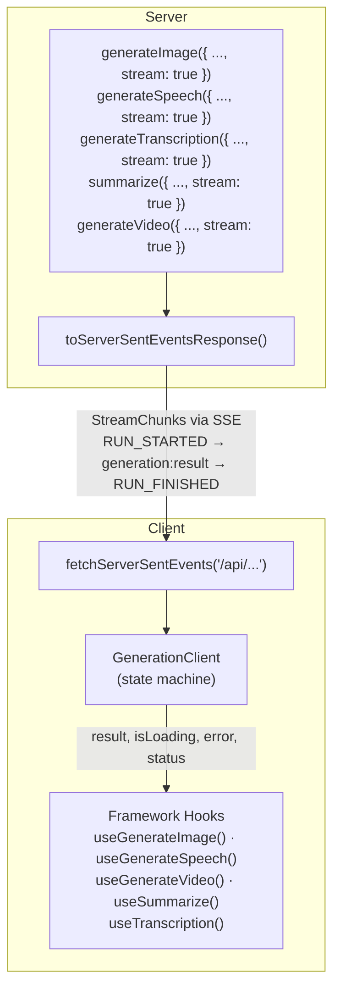

# Generations

You want an image, some speech, a transcript or a video, not a conversation. Every one
of those is a **generation**: one request, one result. They all share the same shape, so
learning one teaches you the rest.

## The fastest path

A server route that streams the result:

```typescript ignore
import { generateImage, toServerSentEventsResponse } from '@tanstack/ai'
import { openaiImage } from '@tanstack/ai-openai'

export async function POST(request: Request) {
  const { prompt } = await request.json()
  const stream = generateImage({
    adapter: openaiImage('dall-e-3'),
    prompt: typeof prompt === 'string' ? prompt : '',
    stream: true,
  })
  return toServerSentEventsResponse(stream)
}
```

A hook that calls it:

```tsx
import { fetchServerSentEvents, useGenerateImage } from '@tanstack/ai-react'

function ImageGenerator() {
  const { generate, result, isLoading, error } = useGenerateImage({
    connection: fetchServerSentEvents('/api/generate/image'),
  })

  return (
    <div>
      <button onClick={() => generate({ prompt: 'A sunset over mountains' })}>
        {isLoading ? 'Generating…' : 'Generate'}
      </button>
      {error && <p role="alert">{error.message}</p>}
      {result?.images.map((img, i) => (
        
      ))}
    </div>
  )
}
```

That is the whole loop. Swap `generateImage` and `useGenerateImage` for any other pair
in the table below and nothing else changes.

## Which transport?

| Transport | Use it when | How |
| --- | --- | --- |
| **Streaming route** | You have an API route. The default, and what the snippets above use. | `stream: true` plus `toServerSentEventsResponse`, and `connection:` on the hook |
| **Direct** | You call a server function and want plain JSON back. Simplest, no streaming. | Return the result from the function, and pass `fetcher:` on the hook |
| **Server function that streams** | You use TanStack Start server functions and want typed input plus streaming. | Return `toServerSentEventsResponse(...)` from the function, and pass `fetcher:` |

The third one is the best of both when you are on Start: input is fully typed and the
streaming is handled for you. All three are written out in
[Transports in full](#transports-in-full).

## Available Generations

| Activity | Server Function | Client Hook (React) | Guide |
|----------|----------------|---------------------|-------|
| Image generation | `generateImage()` | `useGenerateImage()` | [Image Generation](./image-generation) |
| Audio generation | `generateAudio()` | `useGenerateAudio()` | [Audio Generation](./audio-generation) |
| Text-to-speech | `generateSpeech()` | `useGenerateSpeech()` | [Text-to-Speech](./text-to-speech) |
| Transcription | `generateTranscription()` | `useTranscription()` | [Transcription](./transcription) |
| Summarization | `summarize()` | `useSummarize()` | - |
| Video generation | `generateVideo()` | `useGenerateVideo()` | [Video Generation](./video-generation) |

> **Note:** Video generation uses a jobs/polling architecture. The `useGenerateVideo` hook additionally exposes `jobId`, `videoStatus`, `onJobCreated`, and `onStatusUpdate` for tracking the polling lifecycle. See the [Video Generation](./video-generation) guide for details.

## Advanced

### Transports in full

#### Streaming Mode (Connection Adapter)

The server passes `stream: true` to the generation function and sends the result as SSE. The client uses `fetchServerSentEvents()` to consume the stream.

**Server:**

```typescript ignore
import { generateImage, toServerSentEventsResponse } from '@tanstack/ai'
import { openaiImage } from '@tanstack/ai-openai'

// In your API route handler
const stream = generateImage({
  adapter: openaiImage('dall-e-3'),
  prompt: 'A sunset over mountains',
  stream: true,
})

return toServerSentEventsResponse(stream)
```

**Client:**

```tsx
import { useGenerateImage, fetchServerSentEvents } from '@tanstack/ai-react'

const { generate, result, isLoading } = useGenerateImage({
  connection: fetchServerSentEvents('/api/generate/image'),
})
```

#### Direct Mode (Fetcher)

The client calls a server function directly and receives the result as JSON. No streaming protocol needed.

**Server:**

```typescript ignore
import { createServerFn } from '@tanstack/react-start'
import { generateImage } from '@tanstack/ai'
import { openaiImage } from '@tanstack/ai-openai'

export const generateImageFn = createServerFn({ method: 'POST' })
  .inputValidator((data: { prompt: string }) => data)
  .handler(async ({ data }) => {
    return generateImage({
      adapter: openaiImage('dall-e-3'),
      prompt: data.prompt,
    })
  })
```

**Client:**

```tsx
import { useGenerateImage } from '@tanstack/ai-react'
import { generateImageFn } from '../lib/server-functions'

const { generate, result, isLoading } = useGenerateImage({
  fetcher: (input) => generateImageFn({ data: input }),
})
```

#### Server Function Streaming (Fetcher + Response)

Combines the best of both: **type-safe input** from the fetcher pattern with **streaming** from a server function that returns an SSE `Response`. When the fetcher returns a `Response` object (instead of a plain result), the client automatically parses it as an SSE stream.

**Server:**

```typescript ignore
import { createServerFn } from '@tanstack/react-start'
import { generateImage, toServerSentEventsResponse } from '@tanstack/ai'
import { openaiImage } from '@tanstack/ai-openai'

export const generateImageStreamFn = createServerFn({ method: 'POST' })
  .inputValidator((data: { prompt: string }) => data)
  .handler(({ data }) => {
    return toServerSentEventsResponse(
      generateImage({
        adapter: openaiImage('dall-e-3'),
        prompt: data.prompt,
        stream: true,
      }),
    )
  })
```

**Client:**

```tsx
import { useGenerateImage } from '@tanstack/ai-react'
import { generateImageStreamFn } from '../lib/server-functions'

const { generate, result, isLoading } = useGenerateImage({
  fetcher: (input) => generateImageStreamFn({ data: input }),
})
```

This is the recommended approach when using TanStack Start server functions, the input is fully typed (e.g., `ImageGenerateInput`), and the streaming protocol is handled transparently.


### How Streaming Works

When you pass `stream: true` to any generation function, it returns an async iterable of `StreamChunk` events instead of a plain result:

```
1. RUN_STARTED          → Client sets status to 'generating'
2. CUSTOM               → Client receives the result
   name: 'generation:result'
   value: <your result>
3. RUN_FINISHED         → Client sets status to 'success'
```

If the function throws, a `RUN_ERROR` event is emitted instead:

```
1. RUN_STARTED          → Client sets status to 'generating'
2. RUN_ERROR            → Client sets error + status to 'error'
   error: { message: '...' }
```

This is the same event protocol used by chat streaming, so the same transport layer (`toServerSentEventsResponse`, `fetchServerSentEvents`) works for both.

When the server emits `RUN_ERROR`, the client surfaces it on `error` (and sets `status` to `'error'`). Use the `onError` callback to react, and render `error?.message` in your UI:

```tsx
import { useGenerateImage, fetchServerSentEvents } from '@tanstack/ai-react'

function ImageGenerator() {
  const { generate, result, error, status } = useGenerateImage({
    connection: fetchServerSentEvents('/api/generate/image'),
    onError: (err) => console.error('Generation failed:', err.message),
  })

  return (
    <div>
      <button onClick={() => generate({ prompt: 'A sunset over mountains' })}>
        Generate
      </button>
      {status === 'error' && <p role="alert">Error: {error?.message}</p>}
      {result?.images.map((img, i) => (
        
      ))}
    </div>
  )
}
```


### Common Hook API

All generation hooks share the same interface:

| Option | Type | Description |
|--------|------|-------------|
| `connection` | `ConnectionAdapter` | Streaming transport (SSE, HTTP stream, custom) |
| `fetcher` | `(input) => Promise<Result \| Response>` | Direct async function, or server function returning an SSE `Response` |
| `id` | `string` | Unique identifier for this instance |
| `body` | `Record<string, any>` | Additional body parameters (connection mode) |
| `onResult` | `(result) => T \| null \| void` | Transform or react to the result |
| `onError` | `(error) => void` | Error callback |
| `onProgress` | `(progress, message?) => void` | Progress updates (0-100) |

| Return | Type | Description |
|--------|------|-------------|
| `generate` | `(input) => Promise<void>` | Trigger generation |
| `result` | `T \| null` | The result (optionally transformed), or null |
| `isLoading` | `boolean` | Whether generation is in progress |
| `error` | `Error \| undefined` | Current error, if any |
| `status` | `GenerationClientState` | `'idle'` \| `'generating'` \| `'success'` \| `'error'` |
| `stop` | `() => void` | Abort the current generation |
| `reset` | `() => void` | Clear all state, return to idle |

#### Result Transform

The `onResult` callback can optionally transform the stored result:

- Return a **non-null value**, replaces the stored result with the transformed value
- Return **`null`**, keeps the previous result unchanged (useful for filtering)
- Return **nothing** (`void`), stores the raw result as-is

TypeScript automatically infers the result type from your `onResult` return value, no explicit generic parameter needed.

```tsx
import { useGenerateSpeech, fetchServerSentEvents } from '@tanstack/ai-react'
import type { TTSResult } from '@tanstack/ai'

function SpeechPlayer() {
  const { result } = useGenerateSpeech({
    connection: fetchServerSentEvents('/api/generate/speech'),
    onResult: (raw: TTSResult) => ({
      audioUrl: `data:${raw.contentType};base64,${raw.audio}`,
      duration: raw.duration,
    }),
  })
  // result is typed as { audioUrl: string; duration?: number } | null
}
```


### Architecture



The key insight: **every generation activity on the server is just an async function that returns a result**. By passing `stream: true`, the function returns a `StreamChunk` iterable instead of a plain result, which the client already knows how to consume.

