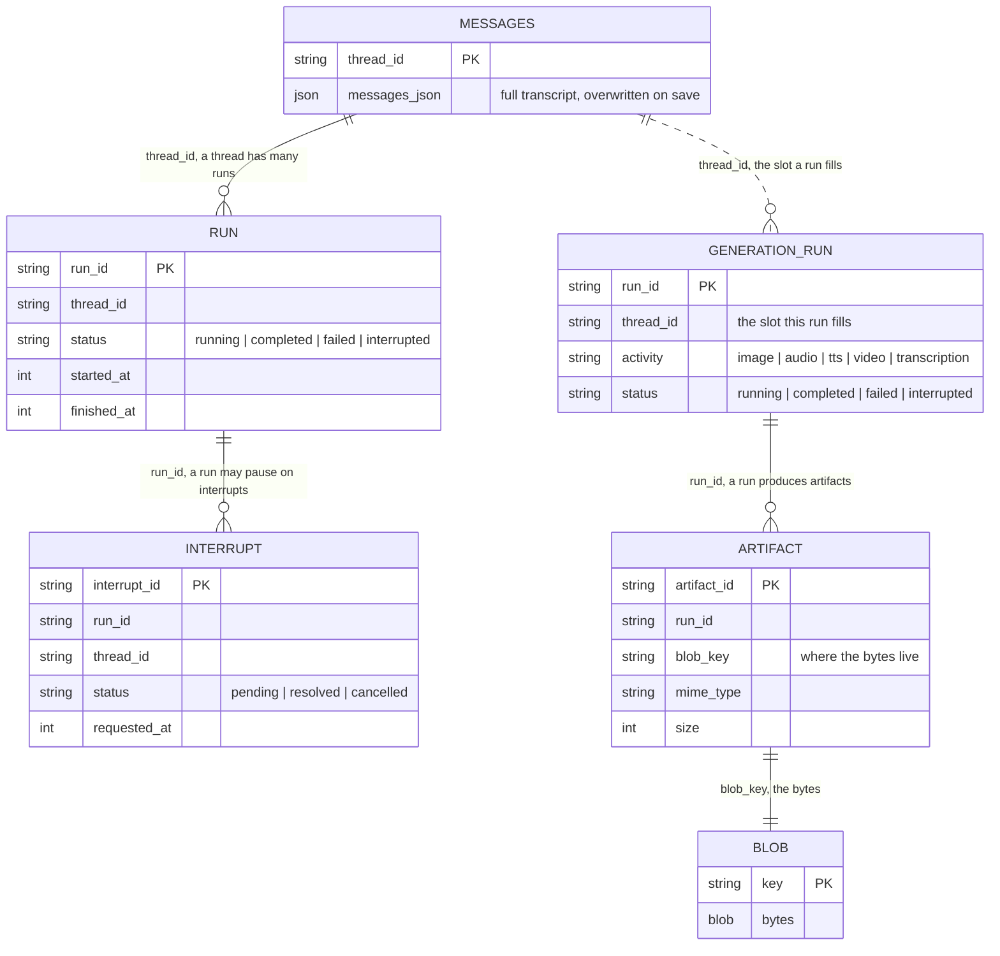

# Build Your Own Persistence Adapter

You want server-side chat persistence, but your data lives in your own database:
Postgres behind Prisma, a SQLite file, Cloudflare D1, Mongo, whatever you already
run. TanStack AI does not ship a backend for your exact stack, and you would
rather not add one more service just for chat history.

You do not need a packaged backend. Server persistence is a small set of plain
store interfaces from `@tanstack/ai-persistence`. Implement the ones you want
against your database, hand the result to `withPersistence`, and you are done.
The core never inspects your tables, so the schema is yours to shape.

This page covers the shape every adapter has, which stores your app actually
needs, and how to verify the result. The two walkthroughs build a real one on
Node's built-in `node:sqlite`, end to end:

- [Build a chat adapter](./build-your-own-chat-adapter): the transcript, run
  lifecycle, durable approvals, and key/value state.
- [Build a generation adapter](./build-your-own-generation-adapter): generation
  runs plus the artifact and blob stores that keep generated media.

The runnable version of both lives in the `examples/ts-react-chat` app
(`src/lib/sqlite-persistence.ts`).

## Which stores do you need?

There are seven stores and you almost certainly do not want all of them. Each one
switches on a single capability. Find the column for what you are building and
implement the rows marked ✅:

| Store | Save the transcript | Rejoin a run after reload | Durable approvals | App key/value | Persist generation runs | Keep generated files |
| --- | :-: | :-: | :-: | :-: | :-: | :-: |
| `messages` | ✅ | ✅ | ✅ | ✅ | ❌ | ❌ |
| `runs` | ❌ | ✅ | ✅ | ❌ | ❌ | ❌ |
| `interrupts` | ❌ | ❌ | ✅ | ❌ | ❌ | ❌ |
| `metadata` | ❌ | ❌ | ❌ | ✅ | ❌ | ❌ |
| `generationRuns` | ❌ | ❌ | ❌ | ❌ | ✅ | ✅ |
| `artifacts` | ❌ | ❌ | ❌ | ❌ | ❌ | ✅ |
| `blobs` | ❌ | ❌ | ❌ | ❌ | ❌ | ✅ |

How to read it:

- **Columns stack.** Want durable approvals *and* generated files? Implement the
  union of those two columns.
- **The four chat columns all need `messages`.** `withPersistence` refuses to run
  without it, so it is the floor for anything chat-related.
- **The two generation columns feed `withGenerationPersistence`** instead, and
  need none of the chat stores. Chat and generation persistence are independent;
  see [Generation persistence](./generation-persistence).

Two pairs cannot be split:

- `interrupts` needs `runs`. An interrupt record is scoped to a run.
- `artifacts` and `blobs` go together. Metadata with no bytes, or bytes with
  nothing describing them, is not a usable combination.

So the smallest adapter worth shipping is a single `messages` store, and the
common production shape is `messages` + `runs` + `interrupts`. The
[chat walkthrough](./build-your-own-chat-adapter) builds them in that order.

## What an adapter is

An adapter is an object with a `stores` map:

```ts
import type { ChatTranscriptPersistence } from '@tanstack/ai-persistence'
// `messages` and `runs` are your store implementations (built below); import
// them from your own modules.
import { messages } from './message-store'
import { runs } from './run-store'

const persistence: ChatTranscriptPersistence = {
  stores: { messages, runs },
}
```

Each store is independent, so provide only the ones you need.

For chat:

- `messages`: the transcript.
- `runs`: run lifecycle.
- `interrupts`: durable approvals. Needs `runs`.
- `metadata`: namespaced key/value state.

For generation:

- `generationRuns`: the generation run lifecycle. The counterpart to `runs`,
  keyed by its own `runId`.
- `artifacts` + `blobs`: keep the generated media bytes. See
  [Build a generation adapter](./build-your-own-generation-adapter).

The middleware turns on behavior for whatever stores it finds, so a
`messages`-only adapter is a valid adapter.

Those seven keys (`messages`, `runs`, `interrupts`, `metadata`,
`generationRuns`, `artifacts`, `blobs`) are the *only* ones `stores` accepts;
anything else throws `Unknown AIPersistence store key` at construction. Need a mutex across
instances? That is `withLocks`; see [Locks](../advanced/locks).

Type each store with its `define*Store` helper, as both walkthroughs do. There
is one per store:

- `defineMessageStore`
- `defineRunStore`
- `defineInterruptStore`
- `defineMetadataStore`
- `defineGenerationRunStore`
- `defineArtifactStore`
- `defineBlobStore`

Each checks the object against the contract inline (autocomplete, no
`: MessageStore` annotation) and composes into `defineAIPersistence`, which
tracks **exact presence**:

- The stores you pass are defined, and their keys autocomplete on
  `persistence.stores`.
- Accessing one you did not pass is a compile error.

Annotate the value with a named shape:

- `ChatPersistence`: all four chat stores.
- `ChatTranscriptPersistence`: the `messages` floor.
- `AIPersistence`: the all-optional bag. `withPersistence` rejects it, because
  `stores.messages` is possibly `undefined`.

Every method signature and invariant is in the
[store reference](./store-reference).
The invariants (idempotent creates, insert-if-absent, ordered listings) are what
the shared conformance suite checks, and getting one wrong is the usual source of
subtle bugs.

The records the stores hold form a small schema. The thread is not a table of
its own; it exists as the `thread_id` key the other records hang off. And
`metadata` is independent of all of it (its identity is `(namespace, key)`).
Note the asymmetry on the generation side. A chat run belongs to a thread, and
its own `run_id` is secondary. A generation run is keyed by its own `run_id`
first, and its `thread_id` names the slot the run fills, which is what
`findLatestForThread` hydrates by:



## Existing database: map the contracts onto your schema

You do not have to create tables at all. If you already have a database, map each
store method onto the tables and columns you already run. Three things change from
the from-scratch walkthroughs.

**Your column names, your types.** The core reads and writes only through your
store methods, so name columns whatever you like and use your database's native
types. Store `messages_json` as a real `jsonb` column on Postgres, use a
`timestamptz` for `started_at` and convert to epoch milliseconds in your row
mapper, split `usage` into real columns if you want to query it. The record shape
the methods return is fixed; how you store it is not.

**Extra columns are fine.** Add a `user_id` to the messages table to scope
threads per user, add `created_at`/`updated_at` audit columns, add a tenant id.
Keep added columns nullable or defaulted so the store's inserts still succeed. The
TanStack AI stores never read or write columns they do not know about.

**Adopt part of it.** You rarely need every store in the same database. Put
`messages` and `runs` in your primary database and nothing else, then fill the
rest from another source with `composePersistence`:

```ts
import { composePersistence, memoryPersistence } from '@tanstack/ai-persistence'
import { messages, runs } from './my-postgres-stores'

// Start from any base and replace the stores you own.
export const persistence = composePersistence(memoryPersistence(), {
  overrides: { messages, runs },
})
```

One caveat: `composePersistence` does not add a transaction across different
systems. If `messages` lives in Postgres and `interrupts` in Redis, a write that
must touch both is two writes; design retries and idempotency for that yourself.
The store invariants (idempotent `createOrResume`, insert-if-absent `create`) are
what make those retries safe, which is exactly why they are invariants.

## Verify with the conformance suite

Do not eyeball it. `@tanstack/ai-persistence` ships the same conformance test
suite every packaged backend runs. Point it at your factory and it exercises
every method of every store you provide, including the ordering and idempotency
rules that are easy to get subtly wrong.

```ts
import { runPersistenceConformance } from '@tanstack/ai-persistence/testkit'
import { sqlitePersistence } from './sqlite-persistence'

runPersistenceConformance('my sqlite adapter', () =>
  sqlitePersistence({ url: ':memory:', migrate: true }),
)
```

The suite covers all seven stores, the four chat state stores and the three
generation stores, so an adapter lists whatever it deliberately omits. A
chat-only adapter skips the generation half:

```ts
import { runPersistenceConformance } from '@tanstack/ai-persistence/testkit'
import { chatOnlyPersistence } from './chat-only'

runPersistenceConformance('chat-only adapter', () => chatOnlyPersistence(), {
  skip: ['generationRuns', 'artifacts', 'blobs'],
})
```

and a transcript-only one skips more:

```ts
import { runPersistenceConformance } from '@tanstack/ai-persistence/testkit'
import { transcriptOnlyPersistence } from './transcript-only'

runPersistenceConformance(
  'transcript-only adapter',
  () => transcriptOnlyPersistence(),
  {
    skip: [
      'runs',
      'interrupts',
      'metadata',
      'generationRuns',
      'artifacts',
      'blobs',
    ],
  },
)
```

`skip` accepts only store keys. A store that is absent and not listed fails the
suite loudly, so you cannot ship a half-wired adapter by accident. When this is
green, your adapter is a drop-in for `withPersistence` (and, with the generation
stores, `withGenerationPersistence`). The `examples/ts-react-chat` app runs
exactly this test against its SQLite backend, which provides all seven.

## Let your coding agent write it

You do not have to write any of this by hand. `@tanstack/ai-persistence` ships
[Agent Skills](../getting-started/agent-skills) that turn it into a recipe your
assistant follows against **your** stack: it reads your existing ORM config,
schema file, and database handle, appends the four tables to the schema you
already have, and writes a single `src/lib/chat-persistence.ts` exporting the
`ChatPersistence`. No new package, no second database client, and no migration
mechanism competing with the one you run.

Install the skills with [TanStack Intent](https://tanstack.com/intent/latest/docs/overview),
which scans `node_modules` for packages that ship skills and writes the mappings
into your agent's config (`AGENTS.md`, `CLAUDE.md`, `.cursorrules`, …):

```bash
pnpm add @tanstack/ai-persistence
npx @tanstack/intent@latest install
```

Then ask for what you want ("add chat persistence to this app") and the
matching skill loads itself into context:

| Skill                                     | Covers                                                              |
| ----------------------------------------- | ------------------------------------------------------------------- |
| `ai-persistence`                          | Entry point, routes to everything below                             |
| `ai-persistence/server`                   | `withPersistence`, run lifecycle, interrupts, `reconstructChat`     |
| `ai-persistence/stores`                   | The store contracts and their invariants                            |
| `ai-core/locks`                           | `LockStore` / `withLocks` coordination (ships in `@tanstack/ai/locks`) |
| `ai-persistence/build-drizzle-adapter`    | `chat-persistence.ts` for a Drizzle app (SQLite / Postgres / MySQL) |
| `ai-persistence/build-prisma-adapter`     | `chat-persistence.ts` for a Prisma app                              |
| `ai-persistence/build-cloudflare-adapter` | `chat-persistence.ts` for a Worker on D1, plus Durable Object locks |
| `ai-persistence/build-custom-adapter`     | `chat-persistence.ts` for anything else: raw `pg`, Kysely, SQLite, Mongo, Supabase |

Browser-side persistence is not in this package. Its skill ships with
`@tanstack/ai` as `ai-core/client-persistence`, alongside the framework code it
teaches.

They are plain Markdown at
`node_modules/@tanstack/ai-persistence/skills/<skill-name>/SKILL.md` if you
prefer to read or follow them yourself.

## Where to go next

- [Build a chat adapter](./build-your-own-chat-adapter): the SQLite walkthrough for the four chat stores.
- [Build a generation adapter](./build-your-own-generation-adapter): generation runs, artifacts, and blobs.
- [Store reference](./store-reference): every method signature and invariant.
- [Controls](./controls): compose stores from different systems.
- [Locks](../advanced/locks): `LockStore` / `withLocks` coordination.
- [Migrations](./migrations): who owns the schema and when to apply changes.
- [Internals](./internals): the middleware lifecycle your stores plug into.
