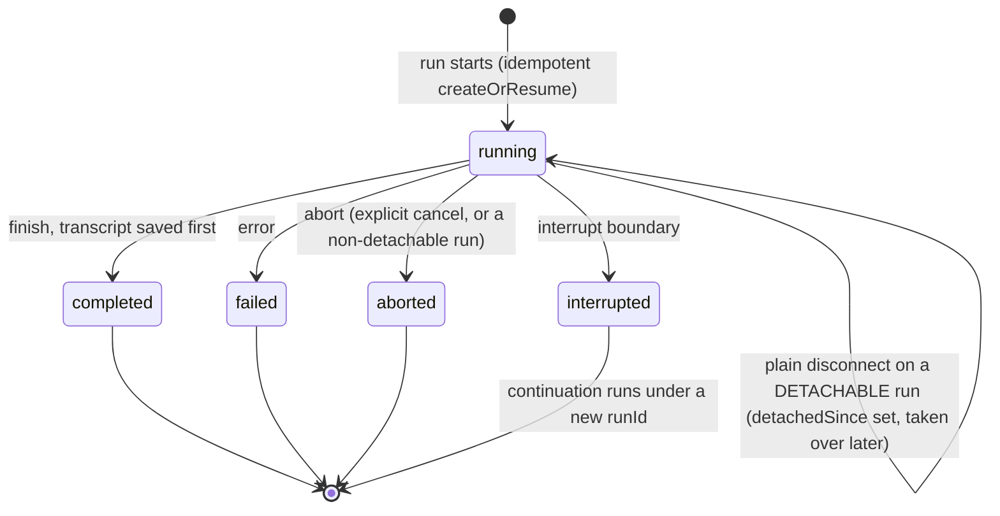
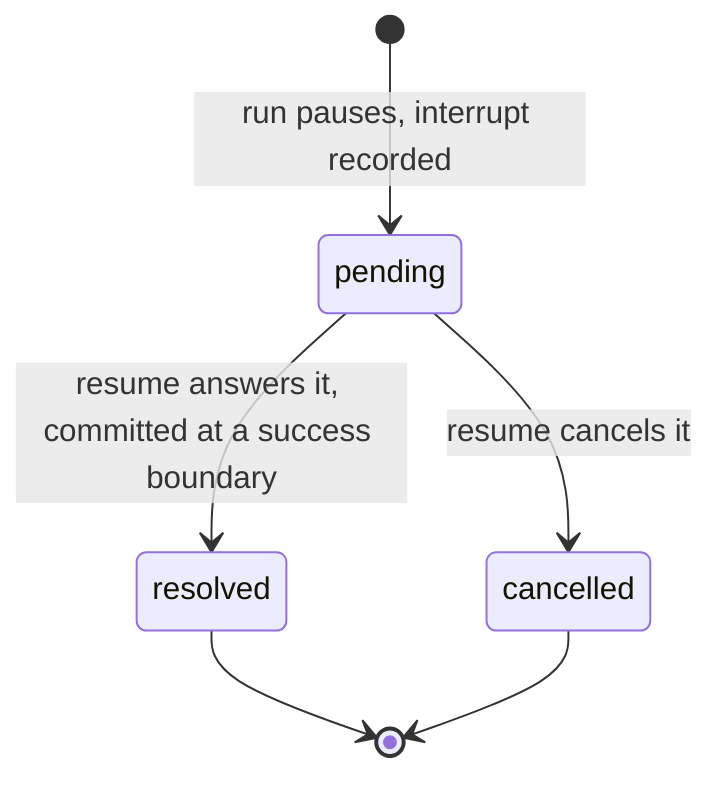

# Chat Persistence

You want a conversation to outlive a single request: the transcript, whether
each run finished or is still waiting on an interrupt, all still there after the
process restarts. `withPersistence` is a chat middleware that writes that
state to a store you choose, so the server owns an authoritative copy of every
thread.

```bash
pnpm add @tanstack/ai-persistence
npx @tanstack/intent@latest install
```

The second command wires this package's [Agent Skills](../getting-started/agent-skills)
into your coding assistant. Run it before you start, because the recipes read your
existing database setup and write the adapter to match, and they encode the
invariants (full-overwrite `saveThread`, insert-if-absent run and interrupt
creates) that are easy to get wrong and expensive to debug.

## Persist state on the server

Add the middleware to `chat()` and point it at a backend. Here `persistence` is a
local `./persistence` module: an adapter you build on the core over the database
you already run. [Build your own adapter](./build-your-own-adapter) walks through
a complete SQLite version end to end.

```ts group=chat-persistence
import {
  chat,
  chatParamsFromRequestBody,
  toServerSentEventsResponse,
} from '@tanstack/ai'
import { openaiText } from '@tanstack/ai-openai'
import { withPersistence } from '@tanstack/ai-persistence'
import { persistence } from './persistence'

export async function POST(request: Request) {
  const params = await chatParamsFromRequestBody(await request.json())
  const stream = chat({
    adapter: openaiText('gpt-5.5'),
    messages: params.messages,
    threadId: params.threadId,
    runId: params.runId,
    // Forward the resume batch so a thread with pending interrupts continues.
    ...(params.resume ? { resume: params.resume } : {}),
    middleware: [withPersistence(persistence)],
  })
  return toServerSentEventsResponse(stream)
}
```

The middleware uses whichever **state** stores the backend provides, no feature
flags. `messages` is required; the rest are optional:

- `messages` (required) loads and saves the full model-message thread.
- `runs` records running, interrupted, completed, failed, or aborted status.
- `interrupts` records pending tool-approval / client-tool / generic waits, and
  requires `runs`.

Need a mutex across workers? Add `withLocks` when other middleware needs
multi-instance coordination; see [Locks](../advanced/locks).

Creating tables on open is convenient for local development. In production, apply
schema changes through your deployment workflow instead. See
[Migrations](./migrations).

## Threads, runs, and turns

The transcript is stored per `threadId`, and each run gets a `runs` record with its
status, timings and usage. One thing follows from that and matters when you wire a
client: a reconnecting client never has to present a run id it may no longer know.
The store resolves the thread's live run with `findActiveRun(threadId)` and the client
tails that.

[Id map](./id-map) covers how to choose a thread id and what both ids mean on the
generation hooks. [How persistence works](./internals) has the rest.

## Send the full transcript, or none of it

`withPersistence` follows one rule, the authoritative-history contract:

- A request with a **non-empty** `messages` array is the full conversation. On
  finish it **overwrites** the stored thread. Post the complete transcript, not
  a delta, or you replace the stored thread with just the newest message.
- A request with an **empty** `messages` array continues a stored thread. The
  middleware loads the stored transcript and the run picks up from there, so the
  client does not have to re-send history.

## What gets persisted, and when

`withPersistence` writes at **four** moments so a reload never loses a turn:

| Moment | What is written | Best-effort? |
| --- | --- | --- |
| **Start of a run** (`onStart`) | Pending turn (just-submitted user message + prior history) so a reload mid-generation still shows the question | Yes. Failure does not abort the run; finish is authoritative |
| **Interrupt boundary** | New interrupt records, run status `interrupted`, and a thread snapshot of current messages | No. Store failures propagate |
| **Finish** (`onFinish`) | Complete transcript (including the terminal assistant reply with its stream `messageId` for in-place reload identity), run status `completed`, and commit of consumed resumes | No. The transcript is saved **before** the run is marked completed |
| **Optionally while streaming** | Throttled partial assistant text when `snapshotStreaming: true` | Yes |

```ts group=chat-persistence
const streamingMiddleware = [
  withPersistence(persistence, { snapshotStreaming: true }),
]
```

Streaming snapshots default off (finish is the authoritative save); enable
them to trade extra writes for partial-output durability. Tune the interval
with `snapshotIntervalMs` (default `1000`).

On **error**, the run is marked `failed`. On **abort**, the run is marked
`aborted` with a `finishedAt`; `interrupted` is written only at an interrupt
boundary, and it is not terminal. Resumes accepted in `onConfig` are **not**
consumed until a success boundary (interrupt or finish), so a failed run leaves
pending interrupts retryable with the same resume batch.

One abort does **not** terminalize: a plain client disconnect on a run that some
other middleware has declared *detachable* (a durable event log plus a run
store, in practice `withSandbox` with durability wired). There, `onAbort` writes
nothing at all, the record stays `'running'`, and the detach path records
`detachedSince` so a later request can take the run over. Intent is never
inferred from the disconnect itself, because a user pressing Stop and a user
closing the tab produce the identical connection close; a cancel arrives out of
band, either as the run's own abort reason or as `RunRecord.cancelRequested`, and
either one makes the abort terminal again. See
[Takeover & Detached Runs](../sandbox/takeover#detach-vs-cancel).

The lifecycle a run record moves through. `completed`, `failed`, and `aborted`
are terminal; `interrupted` is **parked**, not terminal, and a continuation
after one is a new run with a fresh `runId`:



## Interrupts survive a restart

When a run pauses on an interrupt (a tool approval, a client-side tool, a
generic wait), the middleware records it. A later request on that thread must
carry a `resume` batch that answers the pending interrupts before new input is
accepted, otherwise it is rejected, which is why the example above forwards
`params.resume`.

Persistence is the **server-authoritative resume path**: the middleware
validates the resume batch against pending interrupts, builds
`ChatResumeToolState` (approvals / client-tool results), and **clears**
`config.resume` so the chat engine skips its ephemeral reconstruction (which
needs client message history the persistence flow deliberately omits). Resumes
are committed (resolved/cancelled in the store) only once the run reaches a
successful interrupt or finish boundary.

An interrupt record is born `pending` and only a commit moves it, which is why
a failed continuation leaves it answerable again:



## Where to go next

- Bring durability to the browser too, so a full page reload restores the
  conversation and rejoins an in-flight run: [Client persistence](./client-persistence).
- Build the backend on the core, and look up the store contracts:
  [Build your own adapter](./build-your-own-adapter). Whatever you already run
  (Drizzle, Prisma, Cloudflare D1, raw SQL), install the shipped
  [Agent Skills](../getting-started/agent-skills) with
  `npx @tanstack/intent@latest install` and have your assistant write the
  `chat-persistence.ts` against your existing schema.
- Choose which stores to run: [Controls](./controls).
