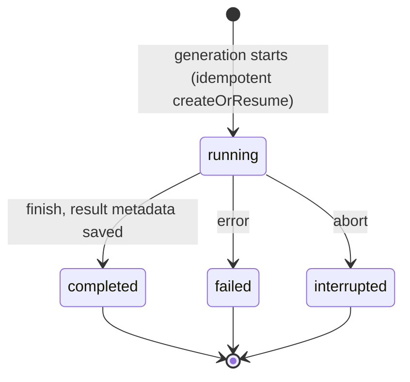
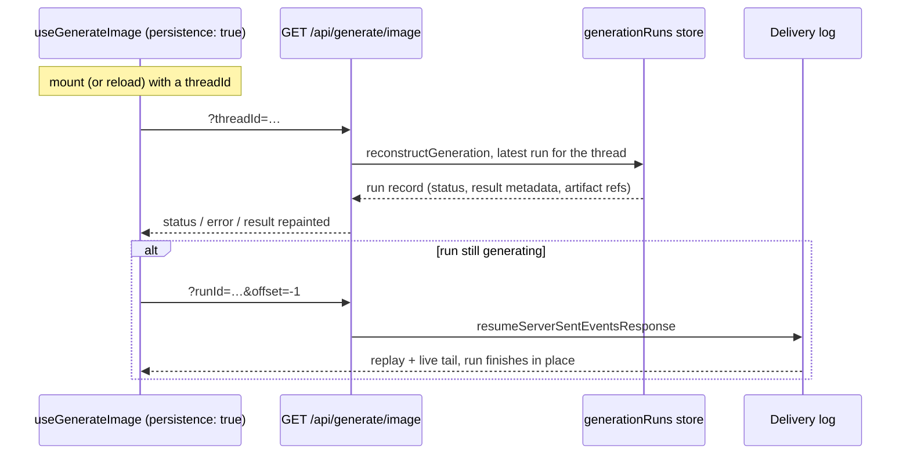

# Generation Persistence

Media generation takes time, and video can take minutes. If the user reloads the
page or their connection drops mid-run, that run is easy to lose. Generation
persistence keeps a small record of each run and restores it into the hook's
normal `status` / `result` / `error` fields, so a reload reads exactly like a
fresh run.

Reach for it when a run is long enough that a reload matters: video, batch
images, long audio, a big transcription. For a quick one-shot image you show and
forget, skip it.

## The id it all hangs on

All of this keys on `threadId`, and for a generation that is a **slot**, not a
conversation: a stable, app-chosen name for the place successive runs fill
(`product-7-hero`, `video-9-start-frame`). Each run gets its own `runId` and its
own record, and restore hands back the newest run in the slot.

Pass the same string to the hook and to the activity, and keep it stable across
reloads. The middleware reads it off the activity, so you never repeat it there.

[Id map](./id-map) covers how to choose one and what goes wrong when it drifts.

## Turn it on

`persistence` is a boolean:

- **`persistence: true`**: the server keeps the record. On mount the hook
  hydrates the last run for its `threadId` and repaints it.
- **omitted / `false`**: off. The run lives in memory only, and a reload starts
  empty.

The record lives on the server, written by `withGenerationPersistence`, which
needs a `generationRuns` store (a `GenerationRunStore` keyed by the run's own
`runId`, with the `threadId` recorded as the slot the run belongs to).
`memoryPersistence()` ships one out of the box; see
[Build a generation adapter](./build-your-own-generation-adapter) for
your own backend.

The browser caches nothing, so a generation's history is never duplicated into
local storage and a second device sees the same run.

The record never holds the generated bytes, so on its own a reload restores
`status` and `error` while `result` stays `null`. To bring the media back too,
add server byte storage: see [Keep generated files](./keep-generated-files).

The record's lifecycle is small, one status field the middleware advances:



A restored `interrupted` run surfaces to the hook as an error. An aborted
generation cannot be resumed, only re-run.

## Wire the route

One `POST` that runs the generation, and a `GET` on the same route that answers
the mount-time hydration with `reconstructGeneration`:

```ts group=generation-server-driven
import {
  generateImage,
  generationParamsFromRequest,
  memoryStream,
  resumeServerSentEventsResponse,
  toServerSentEventsResponse,
} from '@tanstack/ai'
import { openaiImage } from '@tanstack/ai-openai'
import {
  memoryPersistence,
  reconstructGeneration,
  withGenerationPersistence,
} from '@tanstack/ai-persistence'

const persistence = memoryPersistence()

export async function POST(request: Request) {
  const durability = memoryStream(request)
  const { input, threadId } = await generationParamsFromRequest('image', request)

  if (typeof input.prompt !== 'string') {
    throw new Error('This endpoint accepts text image prompts only.')
  }

  // Persistence requires the scope, so a request without one cannot be served:
  // the run would be filed nowhere the client could hydrate from.
  if (threadId === undefined) {
    return new Response('`threadId` is required', { status: 400 })
  }

  const stream = generateImage({
    adapter: openaiImage('gpt-image-2'),
    prompt: input.prompt,
    // The same scope the GET below finds the last run for.
    threadId,
    stream: true,
    // `artifactUrl` makes the restored media render from your own origin. It is
    // optional; see Keep generated files for the serve route it points at.
    middleware: [
      withGenerationPersistence(persistence, {
        artifactUrl: (ref) => `/api/generate/image/artifact?id=${ref.artifactId}`,
      }),
    ],
  })

  return toServerSentEventsResponse(stream, {
    durability: { adapter: durability },
  })
}

export function GET(request: Request): Response | Promise<Response> {
  const durability = memoryStream(request)
  // A reconnecting client carries a resume cursor; replay the live stream.
  if (durability.resumeFrom() !== null) {
    return resumeServerSentEventsResponse({ adapter: durability })
  }
  // Otherwise this is the mount-time hydration (?threadId). In multi-user apps
  // pass reconstructGeneration's `authorize` option so a guessed threadId can't
  // read another user's generation.
  return reconstructGeneration(persistence, request)
}
```

On the client, pass a connection, a stable `threadId`, and `persistence: true`.
The hook is transparent: a reload repaints the last run into the same fields a
fresh run uses, the way `useChat` restores into `messages`:

```tsx
import { fetchServerSentEvents, useGenerateImage } from '@tanstack/ai-react'

const connection = fetchServerSentEvents('/api/generate/image')

export function HeroImageGenerator({ threadId }: { threadId: string }) {
  const image = useGenerateImage({
    threadId,
    connection,
    persistence: true,
  })

  return (
    <section>
      <button
        type="button"
        disabled={image.isLoading}
        onClick={() =>
          void image.generate({ prompt: 'A glass cabin in a pine forest' })
        }
      >
        Generate
      </button>

      {image.status === 'success' ? (
        <p>Last run finished{image.result?.id ? ` (${image.result.id})` : ''}.</p>
      ) : null}
      {image.error ? <p>Last run failed: {image.error.message}</p> : null}
      {image.result?.images.map((img, index) =>
        img.url ?  : null,
      )}
    </section>
  )
}
```

Because the server stamps a durable `artifactUrl`, the restored
`image.result.images[i].url` serves from your own origin, so the image renders
after a reload just as it did live. You never fetch or seed anything: the thread
id is the stable key, and a reload or the same thread on another device follow
the identical path.

If a run is **still generating** when the connection drops or the page reloads,
the client re-attaches to it and finishes it in place, exactly like `useChat`.
The `durability` adapter on `toServerSentEventsResponse` plus the `GET` resume
branch above are all it needs: on mount `reconstructGeneration` reports the live
run and the client tails it through the durability log. In production, swap
`memoryStream` for `durableStream` from `@tanstack/ai-durable-stream`, where
requests span processes. See [Resumable Streams](../resumable-streams/overview).



## Server functions / direct

The HTTP adapters above implement hydration and rejoin for you. With
[TanStack Start](https://tanstack.com/start) server functions (or any direct,
in-process call) there is no `GET` route to hang them on, so you supply the
two handlers yourself (one for mount-time hydration, one for replaying an
in-flight run) and pass them as options alongside the `fetcher` (or to
`stream()` / `rpcStream()`).

Three server functions cover it: one runs the generation, one answers
hydration with `getGenerationHydration`, and one replays the run's durability
log with `replayRunStream`. Both streaming functions return the same thing,
an SSE `Response` from `toServerSentEventsResponse`, so the client decodes
them the same way:

```ts group=generation-server-functions
// server/image.ts
import { createServerFn } from '@tanstack/react-start'
import { z } from 'zod'
import {
  generateImage,
  memoryStream,
  replayRunStream,
  toServerSentEventsResponse,
} from '@tanstack/ai'
import { openaiImage } from '@tanstack/ai-openai'
import {
  getGenerationHydration,
  memoryPersistence,
  withGenerationPersistence,
} from '@tanstack/ai-persistence'
import type { ImageGenerateInput } from '@tanstack/ai-client'

const persistence = memoryPersistence()

export const generateImageFn = createServerFn({ method: 'POST' })
  .inputValidator((data: ImageGenerateInput & { threadId: string }) => data)
  .handler(({ data: { threadId, ...input } }) => {
    if (typeof input.prompt !== 'string') {
      throw new Error('This endpoint accepts text image prompts only.')
    }
    // One run id for both the durability log and the run record, so the
    // rejoin below replays exactly the run hydration reports.
    const runId = crypto.randomUUID()
    const stream = generateImage({
      adapter: openaiImage('gpt-image-2'),
      prompt: input.prompt,
      threadId,
      runId,
      stream: true,
      // `artifactUrl` is optional; see Keep generated files.
      middleware: [
        withGenerationPersistence(persistence, {
          artifactUrl: (ref) => `/api/generate/image/artifact?id=${ref.artifactId}`,
        }),
      ],
    })
    return toServerSentEventsResponse(stream, {
      durability: { adapter: memoryStream({ runId }) },
    })
  })

/**
 * The wire shape for mount hydration, parsed with Zod so that:
 * - TanStack Start gets a JSON-serializable return type (the run record's
 *   `result` is loosely typed, and Start's serializer rejects `unknown`)
 * - the stored record is validated before it crosses the wire
 */
const hydrationSchema = z.object({
  resumeSnapshot: z
    .object({
      schemaVersion: z.literal(1),
      resumeState: z
        .object({ threadId: z.string(), runId: z.string() })
        .nullable(),
      status: z.enum(['idle', 'running', 'complete', 'error']),
      // `z.any()` (not `z.unknown()`) so Start's serializer accepts the values.
      result: z.record(z.string(), z.any()).optional(),
      error: z
        .object({ message: z.string(), code: z.string().optional() })
        .optional(),
      activity: z.string().optional(),
    })
    .nullable(),
  activeRun: z.object({ runId: z.string() }).nullable(),
})

export const getImageHydrationFn = createServerFn({ method: 'GET' })
  .inputValidator(z.string().min(1))
  .handler(async ({ data: threadId }) => {
    // `getGenerationHydration` does no auth, so gate on your session here, the
    // way you would pass `authorize` to `reconstructGeneration`.
    return hydrationSchema.parse(
      await getGenerationHydration(persistence, threadId),
    )
  })

export const joinImageRunFn = createServerFn({ method: 'GET' })
  .inputValidator(z.string().min(1))
  .handler(({ data: runId }) =>
    // Same SSE envelope `generateImageFn` returns, so one client-side decoder
    // covers both.
    toServerSentEventsResponse(replayRunStream(memoryStream({ runId }))),
  )
```

On the client, pass the two handlers next to the `fetcher`. A reload now
hydrates the last run through `getImageHydrationFn`, and a run still
generating is tailed to completion through `joinImageRunFn`. `joinRun` yields
`StreamChunk`s rather than a `Response`, so decode the SSE body yourself and
apply the `signal` there. The server function itself takes only its `data`:

```tsx
import { useGenerateImage } from '@tanstack/ai-react'
import type { StreamChunk } from '@tanstack/ai'
import {
  generateImageFn,
  getImageHydrationFn,
  joinImageRunFn,
} from './server/image'

/** Decode an SSE `Response` from a server function into `StreamChunk`s. */
async function* chunksFromSseResponse(
  response: Response,
  signal?: AbortSignal,
): AsyncGenerator<StreamChunk> {
  if (!response.ok) throw new Error(`Join failed: ${response.status}`)
  const reader = response.body?.getReader()
  if (!reader) return
  const decoder = new TextDecoder()
  let buffer = ''
  try {
    while (!signal?.aborted) {
      const { done, value } = await reader.read()
      if (done) break
      buffer += decoder.decode(value, { stream: true })
      const lines = buffer.split('\n')
      buffer = lines.pop() ?? ''
      for (const line of lines) {
        if (!line.startsWith('data:')) continue
        const data = line.slice(5).trimStart()
        // `JSON.parse` returns the chunk the server encoded.
        if (data) yield JSON.parse(data)
      }
    }
  } finally {
    reader.releaseLock()
  }
}

export function HeroImageGenerator({ threadId }: { threadId: string }) {
  const image = useGenerateImage({
    threadId,
    fetcher: (input) => generateImageFn({ data: { ...input, threadId } }),
    hydrateGeneration: (id) => getImageHydrationFn({ data: id }),
    joinRun: async function* (runId, signal) {
      const response = await joinImageRunFn({ data: runId })
      if (!(response instanceof Response)) {
        throw new Error('joinImageRunFn should return an SSE Response')
      }
      yield* chunksFromSseResponse(response, signal)
    },
    persistence: true,
  })
  // The render is identical to the HTTP example above.
  return <p>{image.status}</p>
}
```

A non-streaming `fetcher` (a plain `Promise<ImageGenerationResult>` rather than
an SSE `Response`) has no in-flight stream to rejoin, so it needs only
`hydrateGeneration`. Drop `joinRun` and the decoder with it.

A restored run that was still generating but has **no** `joinRun` handler to
tail it surfaces as an interrupted error (it cannot be resumed, only re-run)
instead of hanging on `generating` forever.

The same handlers fit the lightweight connection adapters directly,
`stream(factory, { hydrateGeneration, joinRun })` and
`rpcStream(call, { hydrateGeneration, joinRun })`, for in-process or RPC
transports; they also accept a chat `hydrate` handler for `useChat`'s
server-driven persistence.

## What a reload restores

Two things to keep in mind, whichever wiring you used:

- **The hook is transparent.** After a reload it repaints `status`
  (`'idle'` / `'generating'` / `'success'` / `'error'`), `error`, and `result`
  just like a live run. There is no snapshot field to render yourself.
- **`result` needs byte storage to come back.** The run record holds result
  metadata, never the media bytes, so on its own a reload restores `status` and
  `error` while `result` stays `null`. Add byte storage and `artifactUrl`
  ([Keep generated files](./keep-generated-files)) and the restored `result` is
  rebuilt, its media served from your own origin.

## Non-streaming video is two calls

`generateVideo({ stream: true })` runs the whole create → poll → complete
lifecycle inside one call, so persistence sees one run and nothing here applies.

Without `stream: true` it is two calls, and the video does not exist when the
first one returns:

```ts
import { generateVideo, getVideoJobStatus } from '@tanstack/ai'
import {
  memoryPersistence,
  withGenerationPersistence,
} from '@tanstack/ai-persistence'
import { openaiVideo } from '@tanstack/ai-openai'

const persistence = memoryPersistence()
const adapter = openaiVideo('sora-2')
const middleware = [withGenerationPersistence(persistence)]
const threadId = 'product-7-launch-clip'

// Opens the run. Status `running`, and there is no video yet.
const { jobId } = await generateVideo({
  adapter,
  prompt: 'A cat chasing a dog in a sunny park',
  threadId,
  middleware,
})

// Completes that same run. This is what writes the video and its artifacts.
const status = await getVideoJobStatus({ adapter, jobId, threadId, middleware })
```

Pass the same `threadId` and `middleware` to both. **The `jobId` is the whole
correlation**: the run id is derived from it, so the poll finds the run the
submit opened without you storing anything, even from a different request or
process. There is no run id to thread.

Until a poll observes a terminal job state the record stays `running`, which is
the truth: a client hydrating that slot sees a generation still in flight. A
submission that fails records a terminal `error` run instead, so a reload shows
the failure rather than an empty slot.

## Going further

- [Keep generated files](./keep-generated-files): store the generated bytes so
  the media itself survives, not just the record.
