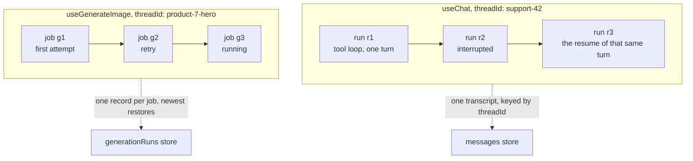

# Id Map

There are only two ids to know, and mixing them up is what makes persistence look
broken.

| Id | Names | Lifetime | You provide it |
| --- | --- | --- | --- |
| `threadId` | the thing runs belong to: a conversation, or a generation slot | as long as your app keeps using the same string | yes, from your own domain |
| `runId` | one execution: one streamed answer, one generation job | minted at the start, dead when it ends | no, it is minted for you |

Persistence stores and restores by `threadId`. `runId` is what you read when you
need to talk to your own server about the execution happening right now.

```tsx
import {
  fetchServerSentEvents,
  useChat,
  useGenerateImage,
} from '@tanstack/ai-react'

export function ProductPage({ productId }: { productId: string }) {
  // Chat: the thread id names a conversation.
  const support = useChat({
    threadId: `support-${productId}`,
    connection: fetchServerSentEvents('/api/chat'),
    persistence: true,
  })

  // Generation: the thread id names a slot that jobs fill.
  const hero = useGenerateImage({
    threadId: `product-${productId}-hero`,
    connection: fetchServerSentEvents('/api/generate/image'),
    persistence: true,
  })

  // Each hook also reports the id of whatever is running right now.
  return (
    <p>
      chat run {support.runId ?? 'none'}, image job {hero.runId ?? 'none'}
    </p>
  )
}
```

## `threadId`: the key everything is filed under

A record is written **per `threadId`** and a reload looks it up **by
`threadId`**. If the string is not identical after the reload, there is nothing to
find. Pick it from your own domain, keep it stable, and restore works. Mint a
fresh one on every mount and nothing ever restores.

### On chat, the thread is the conversation

Every run in it contributes messages to one growing transcript, stored under the
thread id. Restoring means replaying that transcript. Runs are internal detail the
user never sees, they just see the conversation.

### On generation, the thread is a slot

A generation job does not append to anything, it produces one result. So each job
gets its own record, linked to the thread, and restore hands back the **most
recent** job for that thread: its status, its error, its result metadata.
Successive jobs for the same thing (the first attempt, the retry, the regenerate
after a prompt tweak) all land in one slot, and the latest one is what the user is
looking at.

That is why generation thread ids read like a place in your app rather than a
conversation:

| The thing on screen | A good `threadId` |
| --- | --- |
| The hero image for a product | `product-${productId}-hero` |
| The start frame of a video | `video-${videoId}-start-frame` |
| The voice-over of a chapter | `chapter-${chapterId}-narration` |
| A transcription of an upload | `upload-${uploadId}-transcript` |
| The support conversation | `chat-${conversationId}` |

Two rules follow from "one slot, latest job wins":

- **Two different things need two different ids.** Point a hero-image hook and a
  thumbnail hook at the same thread and each restores whatever ran last, in the
  other's UI.
- **The same thing keeps its id forever.** A regenerate is a new job in the same
  slot, not a new slot. That is what makes a reload land on the newest attempt.

## `runId`: one execution

A run is everything between one `RUN_STARTED` and its `RUN_FINISHED`. It is minted
fresh each time and thrown away when it ends. Both kinds of hook report the one
this client has in flight, or `null` when there is none.

### On chat, a run is one turn

It changes from turn to turn, and the mapping to what the user did is not
one-to-one:

- **A whole tool loop is one run.** The model calls a tool, you return a result,
  it calls another, it writes the final answer. However many loops the
  [agentic cycle](../chat/agentic-cycle) takes, that is a single `runId`.
- **One user message can produce several runs.** Pausing on an
  [interrupt](../interrupts/overview) ends the run; resuming continues the same
  turn under a **new** `runId`. Approve two tools in sequence and one message has
  spanned three runs. While the run sits paused waiting on that approval, nothing
  is in flight, so `runId` is `null`.

So `useChat().runId` answers "what is this client running right now", never
"which message is this". In a [live subscription](../chat/streaming), a run
another client started is not yours to cancel, so it is not reported here.



### On generation, a run is the job

One call to `generate(...)` is one job with one `runId`. There is no tool loop and
no interrupt, so the mapping is exactly one-to-one: `runId` is the handle on the
provider work currently in progress.

That makes it the id you hand your own server, because `stop()` only aborts the
local stream. It does not stop a video render already burning credits on the
provider:

```tsx
import { fetchServerSentEvents, useGenerateVideo } from '@tanstack/ai-react'

export function VideoPanel({ videoId }: { videoId: string }) {
  const video = useGenerateVideo({
    threadId: `video-${videoId}-clip`,
    connection: fetchServerSentEvents('/api/generate/video'),
    persistence: true,
  })

  async function cancel() {
    // Stop the provider job server-side, then drop the local stream.
    if (video.runId) {
      await fetch(`/api/generate/video/cancel?runId=${video.runId}`, {
        method: 'POST',
      })
    }
    video.stop()
  }

  return (
    <button type="button" onClick={() => void cancel()} disabled={!video.runId}>
      Cancel
    </button>
  )
}
```

The same id is what a durability log is keyed by, so it is also the right thing to
put in a log line when you are chasing one execution across your server.

## Why restore keys on the thread, not the run

A page that just reloaded has no idea what the last `runId` was, so it cannot ask
for it. It does know its `threadId`, because your app derived it from a product
id, a route param, a video id. So the client presents the thread, and the store
answers "here is what happened in it, and here is the run still going, if any."

Only then does the client tail that run's delivery log. Run ids stay essential one
layer down, they are just never the entry point. See
[Threads and runs](../chat/streaming#threads-and-runs) for the protocol anatomy
and [Resumable streams](../resumable-streams/overview) for the log itself.

## Both sides use the same thread id

Persistence only works when the client and the server file under the same string.
On the client that is the hook's `threadId`. On the server it is the activity's
`threadId`. For generation the middleware reads it straight off the activity,
so there is nothing to repeat on `withGenerationPersistence`:

```ts
import {
  generateImage,
  generationParamsFromRequest,
  toServerSentEventsResponse,
} from '@tanstack/ai'
import { openaiImage } from '@tanstack/ai-openai'
import {
  memoryPersistence,
  withGenerationPersistence,
} from '@tanstack/ai-persistence'

const persistence = memoryPersistence()

export async function POST(request: Request) {
  const { input, threadId } = await generationParamsFromRequest('image', request)

  // No scope, nothing to file the job under, so nothing could ever hydrate it.
  // Reject instead of inventing an id.
  if (threadId === undefined) {
    return new Response('`threadId` is required', { status: 400 })
  }
  if (typeof input.prompt !== 'string') {
    throw new Error('This endpoint accepts text image prompts only.')
  }

  const stream = generateImage({
    adapter: openaiImage('gpt-image-2'),
    prompt: input.prompt,
    threadId,
    stream: true,
    middleware: [withGenerationPersistence(persistence)],
  })

  return toServerSentEventsResponse(stream)
}
```

The client sends its `threadId` on the wire for you, so the hook side is just the
option. Chat is the same shape: the `threadId` you pass `useChat` is the one
`chatParamsFromRequest` hands your route and `withPersistence` stores under. See
[Chat persistence](./chat-persistence) and
[Generation persistence](./generation-persistence) for the full wiring.

## When you can skip `threadId`

Without persistence, `threadId` is optional. The hooks fall back to a generated id
purely to satisfy the protocol, which requires a thread id on the wire. The run
works, it just cannot be found again, which is fine for a one-shot image you show
and forget.

Turn `persistence` on and `threadId` becomes required, on the hook and on the
activity the middleware wraps. `withGenerationPersistence` throws when neither
the activity nor its own `threadId` **override** supplies one. An app that
cannot name the slot has nothing to restore into.

## When restore does nothing

Almost always one of these:

- **The thread id changed.** A `crypto.randomUUID()` or a `useId()` in it means a
  new key on every mount. Log the id on both sides and compare the two strings.
- **The client and server disagree.** The hook files under one id, the middleware
  under another. They must match exactly.
- **You keyed on a run id.** Nothing durable is addressable by `runId` alone from
  a fresh page load. Restore starts from the thread.
- **Byte storage is off.** For generation, the record never holds media bytes, so
  `status` and `error` come back while `result` stays `null`. Add
  [byte storage](./keep-generated-files) to get the media back too.
