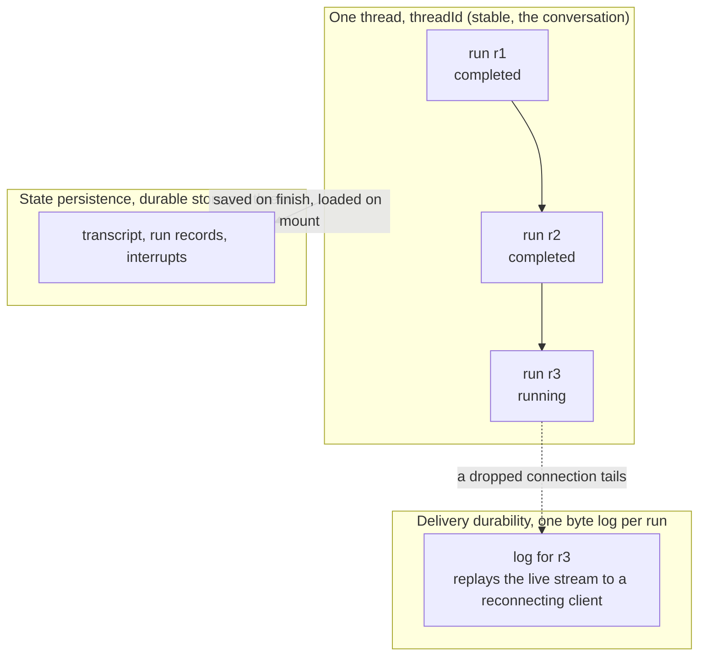
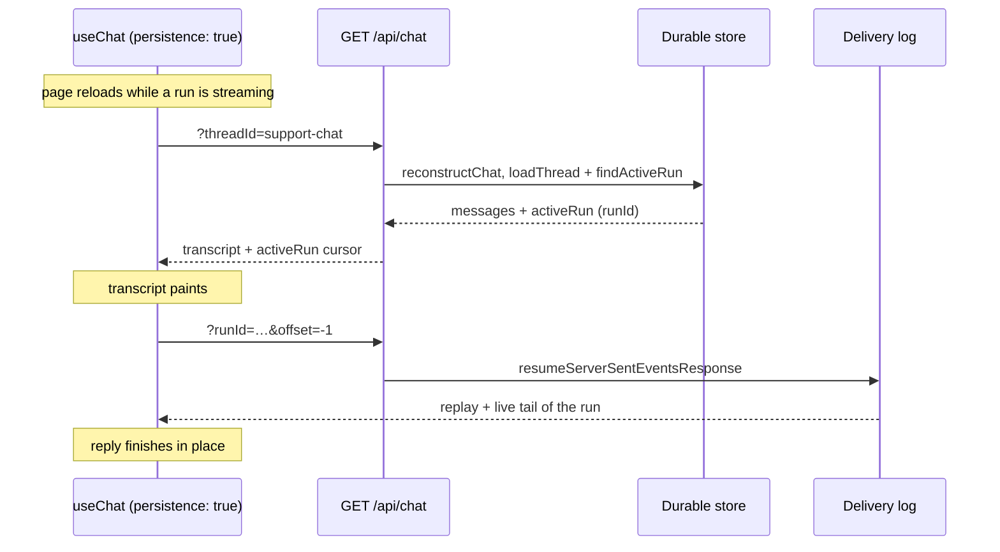

# How Persistence Works

Read this when something surprised you, or before you write a backend. To simply set
persistence up, [the overview](./overview) is three snippets.

## Two layers, not one

| Layer | Answers | Lives | Docs |
| --- | --- | --- | --- |
| **Delivery durability** | "how do I reconnect to a stream that is still running?" | a per-run log, keyed by `runId` | [Resumable Streams](../resumable-streams/overview) |
| **State persistence** | "what is the conversation, and is it still there later?" | a durable store (client and/or server) | this section |

They share no code. Delivery durability replays a live byte stream so a dropped
connection resumes exactly where it stopped. State persistence stores the
conversation itself, so it survives a reload or exists on another device. A replayable
stream is not a saved conversation, and a saved conversation is not a live stream.
Most real apps want both.

## Identity: threads and runs

A **thread** (`threadId`) is the conversation: stable, survives reloads, exists on
every device. A **run** (`runId`) is one execution inside it, minted fresh for each
streamed answer. A thread accumulates many runs; delivery durability logs one run,
state persistence stores the whole thread.



Run ids are too ephemeral to reconnect by, since a reloading client may not know the
current one. Reconnection resolves from the stable `threadId` instead: the store
answers "does this thread have a live run?" (`findActiveRun`), and only then does the
client tail that run's log. [Id map](./id-map) is the short version of both ids.

### Isolation is yours to enforce

Store APIs take a bare `threadId` string, which keeps adapters simple and makes
multi-user isolation your job:

- Derive `Scope.userId` / `Scope.tenantId` **server-side** from session state.
- Authorize before `loadThread` / `saveThread` / `reconstructChat`, with
  `reconstructChat({ authorize })`.
- Never treat a client-supplied thread id as ownership. Thread ids are guessable.

`Scope` is re-exported from `@tanstack/ai-persistence`, so the identity type sits next
to the store contracts.

## Who owns history when both sides persist

One rule decides which copy wins, and you pick it per turn by what the client sends
as `messages`:

- **Non-empty `messages`** means "this is the full history". On finish the server
  overwrites its stored thread with it. The client stays authoritative and the server
  mirrors.
- **Empty `messages`** means "continue from your own copy". The server loads its
  stored transcript and runs from there. The server is authoritative and the client is
  a cache.

That single rule lets both copies coexist with no merge. Two postures fall out of it:
client-authoritative, closest to a pure SPA, and server-authoritative, which is what
makes the same thread open identically on another device.

## What a reload restores

With a client store adapter, `useChat` reads the client record on load and acts on
what it finds:

1. **The run had finished.** The record has the transcript and no resume pointer. The
   conversation paints instantly from storage, with no network.
2. **The run was paused on an interrupt.** The resume pointer carries the pending
   interrupts, so the transcript paints and the approval UI comes back as it was.
3. **The run was still streaming.** The transcript paints from storage, then the
   client rejoins the live run through the durability log and the reply finishes in
   place. This is the one case that needs both layers.

A dropped connection while the page is still open is simpler: delivery durability
reconnects on its own. Persistence matters once the page itself is gone.

Server-authoritative mode paints from a server read instead of `localStorage`. The
delivery log cannot supply that history, because it holds one run, not the thread.

Both layers assume the work itself is over by the time the client comes back:
replaying a log and reading a transcript are both reads of something already
produced. A long-running **sandboxed agent** is the case where neither is enough,
because the run is still going and its producer was the host that disappeared. That
needs a third thing, a later request that adopts the run and keeps driving it. See
[Takeover & Detached Runs](../sandbox/takeover).

## Why server-authoritative is the recommended default

- **One source of truth.** History lives on the server, so no two copies can drift.
  The same conversation opens on any device and survives a restart.
- **A cheap client.** The browser never parses or stores a long transcript, so there
  is no storage quota or startup-parse cost, even for huge threads.
- **Reload durability anyway.** The mount `GET` re-paints the transcript and reports
  any `activeRun`, so the client rejoins it and restores pending interrupts.
- **No wasted work.** That `GET` shares the route with the durable-stream resume, and
  `loadThread` returns ready-made messages instead of replaying a stream to rebuild
  them.



## Separate boundaries

Server state persistence is one of three boundaries that intentionally share no
code:

- **Server state** (this page): `AIPersistence` stores driven by the middleware
  lifecycle, the authoritative record.
- **Client hydration**: the browser restores a rendered conversation, a separate
  concern covered in [Client persistence](./client-persistence).
- **Stream delivery**: replaying an in-flight SSE response,
  [Resumable Streams](../resumable-streams/overview).

State middleware never mutates chunks to add delivery offsets, and it stores
server event state, not the client's rendered messages.

## Chat middleware lifecycle

`withPersistence(persistence)` derives a plan from store presence:

1. `setup` provides persistence, interrupt, and lock capabilities when their
   stores exist.
2. `onConfig` creates or resumes the run, loads pending interrupts, and
   validates the request's resume batch against them, then merges stored
   messages into the request when the request carries no history.
3. `onChunk` reacts only to a `RUN_FINISHED` interrupt outcome by committing
   the accepted resumes, storing the new interrupts, marking the run
   interrupted, and saving messages.
4. `onFinish` and `onError` terminalize the run record. So does `onAbort`, with
   one exception: on a run another middleware has declared detachable, a plain
   disconnect (no cancel recorded in either band) writes nothing and leaves the
   record `'running'` for a later takeover. See
   [Takeover & Detached Runs](../sandbox/takeover#detach-vs-cancel).

Accepted resumes are committed (interrupts marked resolved/cancelled) only once
the run reaches a successful boundary, so a provider failure or abort between
accepting a resume and reaching that boundary leaves the interrupt pending and a
retry with the same resume succeeds. The canonical AG-UI chunk stream remains
unchanged; persistence does not create a second event stream.

When a request carries a non-empty `messages` array it is treated as the full
authoritative history and, on finish, overwrites the stored thread. To continue
a stored thread without resending history, pass an empty `messages` array, and the
stored transcript is loaded and used.

## Reading the stores from your own middleware

Your own middleware often needs the same stores `withPersistence` is already
holding: an audit step that writes to `metadata`, a guard that checks pending
interrupts. Passing the persistence object in twice works but drifts, because
the middleware and your code can end up with different instances.

`withPersistence` publishes what it holds as capabilities instead. Declare what
you need in `requires`, then read it off the context:

```ts
import { chat, defineChatMiddleware, toServerSentEventsResponse } from '@tanstack/ai'
import { openaiText } from '@tanstack/ai-openai'
import {
  InterruptsCapability,
  PersistenceCapability,
  getInterrupts,
  getPersistence,
  memoryPersistence,
  withPersistence,
} from '@tanstack/ai-persistence'
import type { ChatMiddlewareContext } from '@tanstack/ai'

const persistence = memoryPersistence()

const auditPending = defineChatMiddleware({
  name: 'audit-pending',
  // Fails fast at setup when the capability was never provided.
  requires: [PersistenceCapability, InterruptsCapability],
  async setup(ctx: ChatMiddlewareContext) {
    const stores = getPersistence(ctx).stores
    const interrupts = getInterrupts(ctx)
    const pending = await interrupts.listPending(ctx.threadId)
    await stores.metadata?.set(ctx.threadId, 'pending-count', {
      count: pending.length,
    })
  },
})

export async function POST(request: Request) {
  const { messages, threadId } = await request.json()
  const stream = chat({
    adapter: openaiText('gpt-5.5'),
    messages,
    threadId,
    // Order matters: the provider runs before the consumer.
    middleware: [withPersistence(persistence), auditPending],
  })
  return toServerSentEventsResponse(stream)
}
```

Two capabilities are published:

- `PersistenceCapability`, read with `getPersistence(ctx)`: the whole
  `AIPersistence` object, so any store it exposes is reachable.
- `InterruptsCapability`, read with `getInterrupts(ctx)`: the `interrupts` store
  alone, published only when persistence actually has one.

`providePersistence` and `provideInterrupts` are the write halves, for a
middleware of your own that supplies the stores instead of `withPersistence`.
Locks are not part of this: they are a separate capability from
[`@tanstack/ai/locks`](../advanced/locks).

## Generation middleware lifecycle

`withGenerationPersistence(persistence)` records the job across
three points:

- `onStart` creates or resumes the run record.
- `onFinish` / `onError` / `onAbort` terminalize it.
- A result transform captures the terminal result metadata (ids, urls, never
  media bytes) onto the record.

When `artifacts` and `blobs` are both provided it also persists the generated
media and merges the durable refs onto both the result and the run record.

Generation uses its own `generationRuns` store (`GenerationRunStore`), never chat's
`runs` / `messages`. A generation has no conversation, so the run is keyed on
its own `runId` (`ctx.runId ?? ctx.requestId`), and `threadId` never becomes the
job's primary identity.

`threadId` is nonetheless **required**: it is the slot the run is filed under,
and `GenerationRunRecord.threadId` is a required field. The middleware resolves
it as `opts.threadId ?? ctx.threadId` (normally the `threadId` the caller
passed the activity, with the option as an override) and **throws** when
neither supplies one. It is never faked from the request id: a run filed under
an invented scope can never be hydrated by one, so restoring would silently
return nothing forever.

## Composition semantics

```ts
import {
  composePersistence,
  memoryPersistence,
} from '@tanstack/ai-persistence'

const base = memoryPersistence()
const replacement = base.stores.messages

const result = composePersistence(base, {
  overrides: {
    messages: replacement,
    metadata: undefined,
    interrupts: false,
  },
})
```

- `messages` is replaced.
- `metadata` is inherited because the override is `undefined`.
- `interrupts` is removed.
- every omitted store is inherited.

Composition copies the store map and does not mutate or dispose either input.
The return type calculates which keys are required, optional, replaced, or
removed. Unknown store keys are rejected statically and by runtime validation.

Middleware adds entrypoint validation:

- chat requires `messages`; rejects `interrupts` without `runs`.
- generation requires `generationRuns`.
- `reconstructChat` requires `messages`.
- `reconstructGeneration` requires `generationRuns`.

The runtime checks are required because JavaScript, configuration loading, and
explicitly widened types can bypass static guarantees.

## Backend ownership

An adapter owns its own resources: connection lifecycle, when migrations run, and
how each store record maps to rows. The middleware only calls the store methods;
it never opens a connection or inspects a table. A backend may provide any subset
of the stores (for example, no `metadata`), and the return type reflects exactly the
stores it exposes. [Build a chat adapter](./build-your-own-chat-adapter) shows
this end to end for SQLite.

`composePersistence` does not add distributed transactions. When related
stores use different systems, adapter authors must define retry,
idempotency, and consistency behavior.

Two `RunStore` details bind an adapter author beyond the obvious mapping, and
both exist for durable runs. `update` must round-trip `driverEpoch` (the fencing
token a takeover bumps, and the only way a superseded host can discover it lost
the run), and it must distinguish an **omitted** patch key (leave the column
alone) from a key carrying `undefined` (clear the column). The takeover path
clears `detachedSince` exactly that way. See
[Build your own adapter](./build-your-own-adapter) and
[Takeover & Detached Runs](../sandbox/takeover#requirements).
