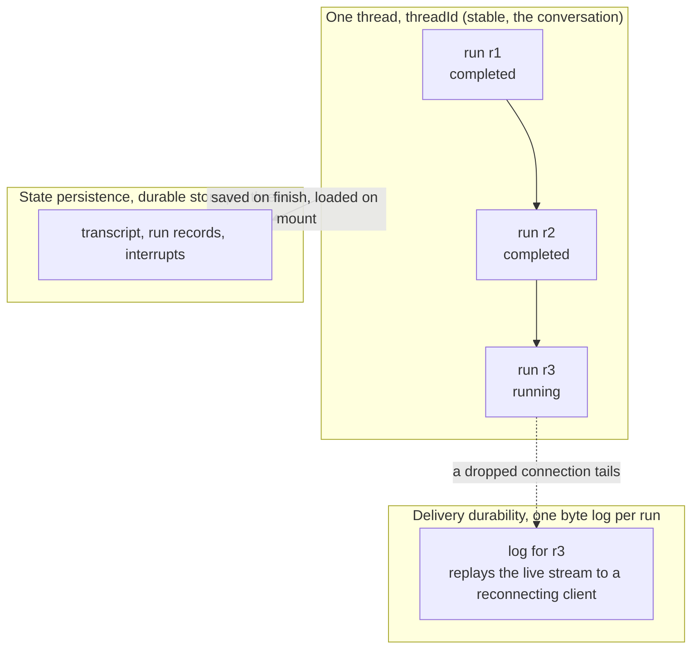
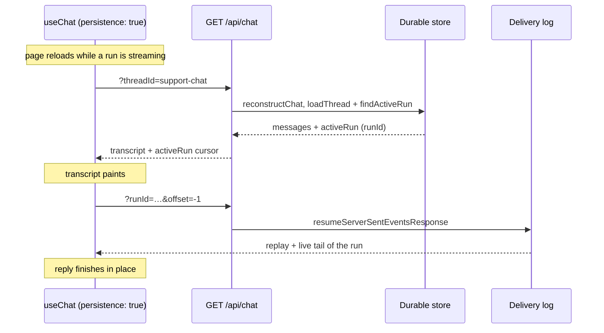

# Durability and Persistence

Three things can go wrong with an AI chat, and they have different fixes:

1. The connection drops mid-answer. The user watched half a reply appear, then the socket died. You don't want to re-run the model and pay for it twice.
2. The user reloads the page. The whole conversation is gone, because it only lived in memory.
3. The user opens the app on another device, or your server restarts. There is no record of the conversation anywhere durable.

TanStack AI solves these with two independent layers. You can use either alone or both together.

## Install

The server half lives in one package. The client half needs no extra install:
it ships with the framework package you already use (`@tanstack/ai-react`,
`-vue`, `-solid`, `-svelte`, `-angular`, or `@tanstack/ai-client`).

```bash
pnpm add @tanstack/ai-persistence
```

Then wire this package's [Agent Skills](../getting-started/agent-skills) into
your coding assistant, before you write any of it:

```bash
npx @tanstack/intent@latest install
```

Run that after the package is installed, not before. Intent scans
`node_modules`, so anything added later needs another run.

## The two layers

| Layer | Answers | Lives | Docs |
| --- | --- | --- | --- |
| **Delivery durability** | "how do I reconnect to a stream that's still running?" | a per-run log, keyed by `runId` | [Resumable Streams](../resumable-streams/overview) |
| **State persistence** | "what is the conversation, and is it still there later?" | a durable store (client and/or server) | this section |

They share no code and solve different problems. Delivery durability replays a live byte stream so a dropped connection resumes exactly where it stopped. State persistence stores the conversation itself, so it survives a reload or exists on another device. A replayable stream is not a saved conversation, and a saved conversation is not a live stream. Real apps usually want both.

The two layers also key on different ids. A **thread** (`threadId`) is the
conversation, the stable identity that survives reloads and exists on every
device. A **run** (`runId`) is one execution inside it: one streamed answer,
minted fresh each time. A thread accumulates many runs over its life; delivery
durability logs one run, state persistence stores the whole thread:



Run ids are too ephemeral to reconnect by, since a reloading client may not know the
current one. Reconnection therefore resolves from the stable `threadId`: the
store answers "does this thread have a live run?" (`findActiveRun`), and only
then does the client tail that run's log.

`threadId` is the key every durable record is filed under, on chat and on the
generation hooks alike, so getting it right is what makes restore work at all.
[Id map](./id-map) is the short version of both ids: what each means on each side,
how to choose a thread id, and why a reload never asks for a run id. The protocol
anatomy of a thread and its runs is in
[Threads and runs](../chat/streaming#threads-and-runs); what persistence records
about them is in [Chat persistence](./chat-persistence#threads-runs-and-turns).

## State persistence has two halves

Persistence runs on the client, the server, or both. They are independent, and they answer different questions.

| Half | Stores | Survives | Use it for |
| --- | --- | --- | --- |
| **Client** ([Client persistence](./client-persistence)) | with a storage adapter, the transcript + a resume pointer in `localStorage` / `sessionStorage` / `IndexedDB`; with `persistence: true`, nothing (hydrates from the server on mount) | a page reload in that browser | instant restore on reload, SPA / offline apps |
| **Server** ([Chat persistence](./chat-persistence)) | messages, run status, interrupts, in your own store | a server restart, and reaches every device | multi-device, audit, durable approvals |

### Identity: `Scope` and `threadId`

Server persistence keys conversation history on **`threadId`**, the same
conversation key as `ChatMiddlewareContext.threadId` and the required field of
the shared `Scope` type from `@tanstack/ai`. Store APIs take a bare `threadId`
string for adapter simplicity; multi-user isolation is still required:

- Derive `Scope.userId` / `Scope.tenantId` **server-side** from session state.
- Authorize before `loadThread` / `saveThread` / `reconstructChat` (use
  `reconstructChat({ authorize })`).
- Never treat a client-supplied thread id alone as ownership, because thread ids
  are guessable.

`Scope` is re-exported from `@tanstack/ai-persistence` so apps can import the
identity type next to the store contracts.

A minimal server setup adds one middleware to `chat()`. Here `persistence` comes
from a local `./persistence` module: a small adapter over a durable store that
you build on the core in a few lines. See
[Build your own adapter](./build-your-own-adapter) for a complete SQLite
implementation you can copy.

```ts
import {
  chat,
  chatParamsFromRequest,
  toServerSentEventsResponse,
} from '@tanstack/ai'
import { openaiText } from '@tanstack/ai-openai'
import { withPersistence } from '@tanstack/ai-persistence'
import { persistence } from './persistence'

export async function POST(request: Request) {
  const params = await chatParamsFromRequest(request)
  const stream = chat({
    adapter: openaiText('gpt-5.5'),
    messages: params.messages,
    threadId: params.threadId,
    runId: params.runId,
    ...(params.resume ? { resume: params.resume } : {}),
    middleware: [withPersistence(persistence)],
  })
  return toServerSentEventsResponse(stream)
}
```

The client half is one option on `useChat`, `persistence`, and it takes two forms:

- **`persistence: true`**: server-authoritative. The client caches nothing and
  hydrates the thread from the server by its `threadId` on mount. Pair this with
  the server `withPersistence` above; it is the setup [we recommend](#what-we-recommend).
- **`persistence: <adapter>`**: client-authoritative. A storage adapter
  (`localStoragePersistence()` / `sessionStoragePersistence()` /
  `indexedDBPersistence()`) keeps the transcript in the browser, no server needed.

```tsx
import { fetchServerSentEvents, useChat } from '@tanstack/ai-react'

function Chat() {
  const { messages, sendMessage } = useChat({
    threadId: 'support-chat',
    connection: fetchServerSentEvents('/api/chat'),
    // Server owns history (pairs with withPersistence above):
    persistence: true,
    // Or keep the transcript in the browser instead:
    // persistence: localStoragePersistence(),
  })
  // ...
}
```

## Who owns the history: client or server

When both halves are on, one rule decides which copy is authoritative, and you pick it per turn by what the client sends as `messages`:

- **Non-empty `messages`** means "this is the full history." On finish the server overwrites its stored thread with it. The client stays authoritative; the server mirrors.
- **Empty `messages`** means "continue from your own copy." The server loads its stored transcript and runs from there. The server is authoritative; the client is a cache.

That single rule lets the two copies coexist without a merge conflict. Two postures come out of it:

- **Client-authoritative**: keep sending the full transcript. `localStorage` is the truth, the server store is a durable backup. Closest to a pure SPA.
- **Server-authoritative**: send empty `messages` and let the server own history. The same thread then opens identically on another device, or after the browser cache is cleared.

## What happens on a page reload

With a client store adapter, on load `useChat` reads the client record and acts on what it finds:

1. **The run had finished.** The record has the transcript, no resume pointer. The conversation paints instantly from storage. No network. (client persistence alone)
2. **The run was paused on an interrupt.** The resume pointer carries the pending interrupts. The transcript paints and the approval UI comes back exactly as it was. (client persistence alone)
3. **The run was still streaming.** The transcript paints from storage, then the client rejoins the live run through the durability log and the reply finishes in place. This is the one case that needs **both** layers: persistence supplies the transcript and the `runId`, durability replays the rest. (client persistence + delivery durability)

A dropped connection while the page is still open is simpler: delivery durability reconnects on its own, no persistence needed. Persistence matters once the page itself is gone.

If you run server-authoritative with the transcript kept off the client (see [Client persistence](./client-persistence)), the reload paints from a server read instead of `localStorage`. The delivery log cannot supply that history: it holds one run, not the whole thread.

## When to pick each

| You want | Turn on |
| --- | --- |
| A dropped connection to resume the same answer | Delivery durability ([Resumable Streams](../resumable-streams/overview)) |
| The conversation to still be there after a reload | [Client persistence](./client-persistence) |
| Reload durability without caching big histories client-side | Client persistence with `persistence: true` |
| The same conversation on another device, or after a server restart | Server persistence ([Chat persistence](./chat-persistence)) |
| Pause for a human approval and resume it later, durably | Server persistence with an `interrupts` store |
| A mid-stream reload to pick up the live answer | Client persistence + delivery durability together |

Most production chat apps end up with all three: delivery durability on the route, client persistence for instant reload, and server persistence as the record of record.

## What we recommend

For a real multi-user app, one combination beats the rest:

1. **Client: cache nothing** with `persistence: true`. The browser holds no transcript and no resume pointer; on mount it hydrates the thread from the server by its `threadId`.
2. **Server: `withPersistence`** owns the authoritative history, run status, and durable interrupts.
3. **One `GET` endpoint that does two jobs**: rehydrate the conversation from the store, and resume an in-flight durable stream.

The server route:

```ts
import {
  chat,
  chatParamsFromRequest,
  memoryStream,
  resumeServerSentEventsResponse,
  toServerSentEventsResponse,
} from '@tanstack/ai'
import { openaiText } from '@tanstack/ai-openai'
import {
  reconstructChat,
  withPersistence,
} from '@tanstack/ai-persistence'
import { persistence } from './persistence'

export async function POST(request: Request) {
  const params = await chatParamsFromRequest(request)
  const stream = chat({
    adapter: openaiText('gpt-5.5'),
    messages: params.messages,
    threadId: params.threadId,
    runId: params.runId,
    ...(params.resume ? { resume: params.resume } : {}),
    middleware: [withPersistence(persistence)],
  })
  return toServerSentEventsResponse(stream, {
    durability: { adapter: memoryStream(request) },
  })
}

export function GET(request: Request): Response | Promise<Response> {
  const durability = memoryStream(request)
  // In-flight run: the resume offset arrives via the Last-Event-ID header or
  // ?offset, and the run id via the X-Run-Id header or ?runId, so ask the
  // adapter with resumeFrom() instead of sniffing query params. Replay the log
  // so a reload finishes the answer.
  if (durability.resumeFrom() !== null) {
    return resumeServerSentEventsResponse({ adapter: durability })
  }
  // Otherwise rehydrate the conversation from the durable store. `reconstructChat`
  // reads `?threadId` and returns `{ messages, activeRun }`: the transcript plus
  // a cursor to any run still generating.
  //
  // Security: without `authorize`, any caller who knows a thread id receives the
  // full transcript. In multi-user apps, check session ownership here (or only
  // ever pass a server-validated thread id).
  return reconstructChat(persistence, request, {
    authorize: async (threadId, req) => {
      // Replace with your session + ownership check, e.g.:
      // const user = await auth(req)
      // return user != null && (await db.threadOwnedBy(user.id, threadId))
      void threadId
      void req
      return true
    },
  })
}
```

The client caches nothing. `useChat` calls that `GET` for you on mount:

```tsx
import {
  fetchServerSentEvents,
  useChat,
} from '@tanstack/ai-react'

function Chat() {
  const { messages, sendMessage } = useChat({
    threadId: 'support-chat',
    connection: fetchServerSentEvents('/api/chat'),
    persistence: true,
  })
  // Nothing else to wire. On mount useChat fetches GET /api/chat?threadId=...,
  // paints the returned transcript, and tails any run still generating.
}
```

A mid-stream reload does both jobs off the same `GET`, and `useChat` drives both
for you: it fetches the transcript (`?threadId`, the reconstruct branch), then,
when `reconstructChat` reports an `activeRun`, tails that run
(`?offset=-1&runId`, the resume branch). The `if` in the handler routes each
request; one is never asked to do both. The replayed run's messages merge into
the transcript by message id, so nothing is duplicated or lost. Because the
reconnect is resolved from the stable `threadId` on the server, a reload and the
same thread opened on another device resume the same way.



Why this wins over the alternatives:

- **One source of truth.** History lives on the server, so there is no client/server copy to drift or reconcile. The same conversation opens on any device and survives a server restart.
- **A cheap client.** The browser never parses or stores a long transcript, so there is no `localStorage` quota or startup-parse cost, even for huge threads.
- **Full reload durability anyway.** The mount `GET` re-paints the transcript and, when a run is still generating, reports its `activeRun` so the client rejoins it and restores pending interrupts. A reload picks up exactly where it left off.
- **No wasted work.** The `GET` reuses the same route as the durable-stream resume, and `loadThread` returns ready-made messages instead of replaying a stream to reconstruct them.

Client-only persistence can't do multi-device and bloats storage. Caching everything client-side duplicates the source of truth. This combination avoids both: one server-resolved `GET` on mount restores history and rejoins any live run, so a reload and a second device follow the identical path.

## Generation persistence

Everything above is about chat. Media generation (image, audio, TTS, video, and
transcription) persists as a sibling to it. The generation hooks
(`useGenerateImage`, `useGenerateVideo`, …) take a `persistence` option too, so a
long run's status and result survive a reload or a dropped connection the same
way a conversation does. Theirs is **boolean only**: the record lives on the
server, and the browser caches nothing.

On the server it is backed by a `generationRuns` store (the generation
counterpart to chat's `runs`), with optional `artifacts` + `blobs` stores to keep
the generated bytes after the provider's URLs expire.

See [Generation persistence](./generation-persistence) for the record's
lifecycle and the server wiring, and
[Keep generated files](./keep-generated-files) for byte storage.

## The store contract

Server **state** persistence is a set of stores. Middleware activates behavior
from whichever stores are present (with entrypoint requirements, see
[Controls](./controls)). There is no separate enable list.

| Store | Purpose |
| --- | --- |
| `messages` | Authoritative model-message history per thread. Required by chat persistence. |
| `runs` | Run status, timing, errors, and usage. Required on full `ChatPersistence`. |
| `interrupts` | Pending, resolved, or cancelled human/tool waits (needs `runs`). |
| `metadata` | App and integration key/value state. |
| `generationRuns` | Generation run status, result metadata, and artifact refs, keyed by the run's own `runId`. Required by generation persistence. |
| `artifacts` | Generated-file metadata (needs `blobs`). |
| `blobs` | The generated bytes (needs `artifacts`). |

The last three are the generation counterpart to the chat stores, used by
`withGenerationPersistence` rather than `withPersistence`, see
[Generation persistence](./generation-persistence).

Named shapes, covered in [Controls](./controls):

- `ChatTranscriptStores`: the `messages` floor.
- `ChatPersistenceStores`: all four chat stores.
- `ChatWithInterruptsStores`: `messages` + `runs` + `interrupts`.

Need a mutex across instances (cross-worker coordination)? Use `withLocks` and a
`LockStore` from `@tanstack/ai/locks`; see [Locks](../advanced/locks).

`@tanstack/ai-persistence` ships the contracts, the middleware, an in-memory
reference backend, and a conformance testkit, but not a backend for your database.
You implement the stores against whatever you already run;
[Build your own adapter](./build-your-own-adapter) walks through a complete one.

If you ran `intent install` [above](#install), you can skip the
typing: ask your assistant for "add chat persistence to this app" and the recipe
matching your database loads itself. The full skill list is in
[Build your own adapter](./build-your-own-adapter#let-your-coding-agent-write-it).

## Where to go next

- [Id map](./id-map): `threadId` vs `runId`, and what each means on chat and on generation.
- [Chat persistence](./chat-persistence): the server middleware, the authoritative-history contract, and durable interrupts.
- [Client persistence](./client-persistence): client- vs server-authoritative modes (`persistence: true`), reload restore, storage backends, and mid-stream rejoin.
- [Generation persistence](./generation-persistence): the same modes for media runs (image, audio, TTS, video, transcription), backed by a `generationRuns` store.
- [Keep generated files](./keep-generated-files): save the generated bytes to your own storage so they outlive the provider's expiring URLs.
- [Controls](./controls): compose backends per store and choose which stores to run.
- [Build your own adapter](./build-your-own-adapter): the shape of an adapter, which stores you need, and how to verify one.
- [Build a chat adapter](./build-your-own-chat-adapter): a complete SQLite walkthrough for the four chat stores.
- [Build a generation adapter](./build-your-own-generation-adapter): the same for generation runs, artifacts, and blobs.
- [Store reference](./store-reference): every store method signature and invariant.
- [Resumable streams](../resumable-streams/overview): the delivery-durability layer in full.
- [Internals](./internals): the middleware lifecycle and composition mechanics behind every backend.
