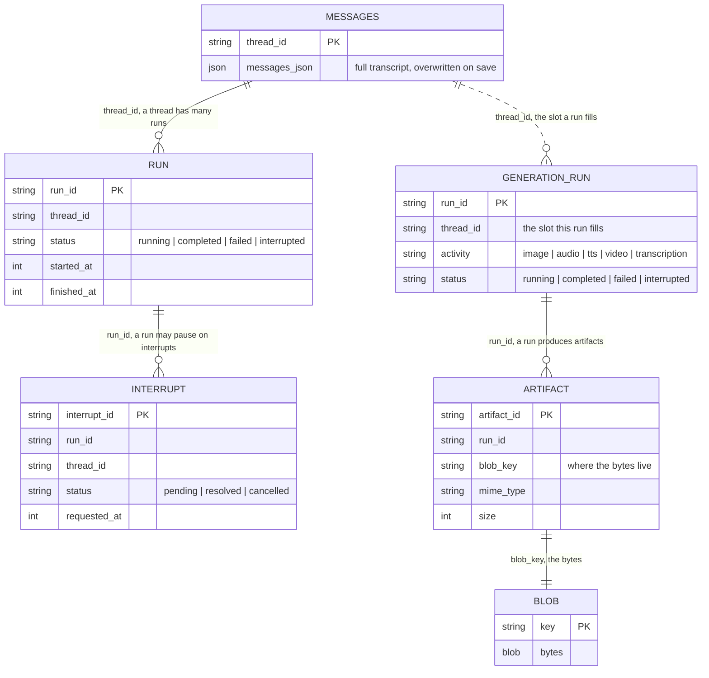

# Store Reference

These are the public contracts from `@tanstack/ai-persistence`. Implement only the
stores you need. Middleware turns behavior on from whichever stores are present, so
there is no separate enable list.

| Store | Purpose | Used by |
| --- | --- | --- |
| `messages` | Authoritative model-message history per thread. | `withPersistence`, required |
| `runs` | Run status, timing, errors, usage. | `withPersistence` |
| `interrupts` | Pending, resolved or cancelled human waits. Needs `runs`. | `withPersistence` |
| `metadata` | App and integration key/value state. | `withPersistence` |
| `generationRuns` | Generation run status and result metadata, keyed by its own `runId`. | `withGenerationPersistence`, required |
| `artifacts` | Generated-file metadata. Needs `blobs`. | `withGenerationPersistence` |
| `blobs` | The generated bytes. Needs `artifacts`. | `withGenerationPersistence` |

Named groupings of the chat stores (`ChatTranscriptStores`, `ChatPersistenceStores`,
`ChatWithInterruptsStores`) are covered in [Controls](./controls).

`runs` is typed against `RunRecord` and `RunStore` from `@tanstack/ai`, not from this
package. One definition is what lets chat persistence and a sandbox run driver key on
the same record instead of disagreeing about one run.

## MessageStore

```ts
import type { ModelMessage } from '@tanstack/ai'

interface MessageStore {
  loadThread(threadId: string): Promise<Array<ModelMessage>>
  saveThread(threadId: string, messages: Array<ModelMessage>): Promise<void>
}
```

`saveThread` receives the full authoritative model-message history, not a delta.
`loadThread` returns `[]` (never `null`) for a thread that was never saved.

## RunStore

`RunStore` and `RunRecord` come from `@tanstack/ai`; `@tanstack/ai-persistence`
re-exports both, which is why the samples on this page import them from either
package. `RunError` is exported from `@tanstack/ai` only.

```ts
import type { TokenUsage } from '@tanstack/ai'

type TerminalRunStatus = 'completed' | 'failed' | 'aborted'
type RunStatus = 'running' | 'interrupted' | TerminalRunStatus

// Why a run failed. `message` is the provider's prose, which changes between
// model versions and cannot be branched on; `code` is the stable
// classification a consumer switches over to retry, escalate, or show a
// specific UI. Providers do not always supply one, so `code` is optional.
interface RunError {
  message: string
  code?: string
}

interface RunRecord {
  runId: string
  threadId: string
  status: RunStatus
  startedAt: number // epoch ms
  finishedAt?: number // epoch ms, set once the run reaches a terminal status
  error?: RunError
  usage?: TokenUsage // token counts, from @tanstack/ai
  // ---------------------------------------------------------------------------
  // DURABLE SANDBOXED RUNS ONLY. A chat app never writes these four and nothing
  // in `@tanstack/ai-persistence` reads them. Leave the columns out until you
  // wire `withSandbox(sandbox, { runs, durability })`, and see
  // [Build a Sandbox Adapter](./build-a-sandbox-adapter#the-four-run-fields)
  // for what each one does and how to prove them.
  // ---------------------------------------------------------------------------
  sandboxKey?: string // which sandbox this run is bound to
  detachedSince?: number // epoch ms since the last viewer left
  cancelRequested?: boolean // an out-of-band cancel was recorded
  driverEpoch?: number // fencing token, bumped by each host that claims the run
}

interface RunStore {
  // Required: insert-if-absent. An existing runId returns the stored record
  // unchanged, so resuming a run never resets its startedAt or status.
  createOrResume(input: {
    runId: string
    threadId: string
    status?: RunStatus
    startedAt: number
  }): Promise<RunRecord>
  // Required: patching an unknown runId is a no-op, not an error.
  update(
    runId: string,
    patch: Partial<
      Pick<
        RunRecord,
        | 'status'
        | 'finishedAt'
        | 'error'
        | 'usage'
        | 'sandboxKey'
        | 'detachedSince'
        | 'cancelRequested'
        | 'driverEpoch'
      >
    >,
  ): Promise<void>
  // Required.
  get(runId: string): Promise<RunRecord | null>
  // Required. The most recent 'running' run for a thread (greatest
  // `startedAt` wins), or null when the thread is idle. `reconstructChat`
  // calls it to report `activeRun`, which is how a hydrating client tails a
  // run that is still generating.
  findActiveRun(threadId: string): Promise<RunRecord | null>
  // Optional. Every run for a thread, ascending by startedAt. Only needed to
  // render a thread's past agent activity.
  listByThread?(threadId: string): Promise<Array<RunRecord>>
  // Optional. Runs where status is 'running' and detachedSince <= now - ttlMs
  // (inclusive). This is the query `reapDetachedRuns` (@tanstack/ai-sandbox)
  // runs to find abandoned runs; scheduling that sweep is the app's job.
  listReclaimable?(opts: {
    now: number
    ttlMs: number
  }): Promise<Array<RunRecord>>
}
```

`createOrResume`, `update`, `get`, and `findActiveRun` are the floor: a backend
that implements those four is a valid `RunStore`. Three contracts to hold:

- `createOrResume` must be idempotent. A second call for an existing `runId`
  returns the stored record unchanged, which is what makes resuming a run safe.
  Retries may repeat the same run id.
- `update` against an unknown `runId` is a no-op.
- `findActiveRun` must do real work. Stub it to `null` and `reconstructChat`
  always reports `activeRun: null`, so a client that reloads (or switches back
  to) a still-generating thread restores the transcript but never resumes the
  live reply. Nothing detects it either, because `null` is also the right answer
  for an idle thread. It was optional for exactly one release cycle and cost
  precisely that, which is why it is required now.

`listByThread` and `listReclaimable` are genuinely optional, not
recommended-but-checked: consumers feature-detect each one and degrade when it is
absent, and the conformance suite skips a method's test cases once you declare
the omission in `skipMethods`. Implement the ones your app needs:

- Skip `listByThread` and you cannot render a thread's past runs.
- Skip `listReclaimable` and the store cannot be reaped: `reapDetachedRuns`
  feature-detects it, logs one line, and sweeps nothing, so detached runs are
  never finalized and their sandboxes never reclaimed. `detachedSince` *is*
  populated for you by `withSandbox`'s detach path, and note that the reaper is a
  function the application schedules, so implementing this method is necessary
  but not by itself sufficient. See
  [Takeover & Detached Runs](../sandbox/takeover#configuration) for the option,
  and [Reaping & Retention](../sandbox/reaping) for the sweep itself and the
  schedules that drive it.

The four durable-run fields are a sandbox concern, so they are documented and
proven on the sandbox side:
[Build a Sandbox Adapter](./build-a-sandbox-adapter#the-four-run-fields).
`runPersistenceConformance` does not assert them, and a chat-only backend can leave
the columns out entirely. If you do wire durable sandboxed runs, run
`runDurableRunFieldsConformance` from `@tanstack/ai-sandbox/testkit` against the same
`runs` store: each field breaks one mechanism silently when dropped, which is why it
gets its own suite rather than a paragraph of warnings.

Two helpers travel with the contract, and both exist so a caller does not have
to reach for a cast:

- Deciding "can this run still emit events?" from a bare `RunStatus` string
  leaves you holding the wide union afterwards. `isTerminalRunStatus` is a type
  predicate, so inside the guard the status is a `TerminalRunStatus` and can be
  passed wherever one is required.

  ```ts
  import { isTerminalRunStatus } from '@tanstack/ai-persistence'
  import type { RunRecord, TerminalRunStatus } from '@tanstack/ai-persistence'

  function finalStatus(run: RunRecord): TerminalRunStatus | null {
    return isTerminalRunStatus(run.status) ? run.status : null
  }
  ```

- An optional method you did implement should not need a `?.` from inside your
  own code. `defineRunStore` is generic over the object you pass, so the result
  keeps that object's exact shape: `createRunStore(db).findActiveRun(threadId)`
  is a direct call on the store built in the
  [chat walkthrough](./build-your-own-chat-adapter), while a consumer holding a
  bare `RunStore` still feature-detects the same method.

Capability tiers belong at the STORE level, not the method level. A backend that
genuinely has no run lifecycle should declare `ChatTranscriptStores` and omit
`runs` entirely rather than supply a `RunStore` with a stubbed method: an absent
store is caught by the type system, an incomplete one fails silently at runtime.

The reference implementation, `MemoryRunStore` in
`packages/ai-persistence/src/memory.ts`, implements all six. The
`examples/ts-react-chat` SQLite adapter (`src/lib/sqlite-persistence.ts`)
implements the four required methods plus `listReclaimable`, and declares
`runs.listByThread` as skipped.

## InterruptStore

```ts
interface InterruptRecord {
  interruptId: string
  runId: string
  threadId: string
  status: 'pending' | 'resolved' | 'cancelled'
  requestedAt: number // epoch ms
  resolvedAt?: number // epoch ms, set once resolved or cancelled
  payload: Record<string, unknown>
  response?: unknown
}

interface InterruptStore {
  create(record: Omit<InterruptRecord, 'status' | 'resolvedAt'>): Promise<void>
  resolve(interruptId: string, response?: unknown): Promise<void>
  cancel(interruptId: string): Promise<void>
  get(interruptId: string): Promise<InterruptRecord | null>
  list(threadId: string): Promise<Array<InterruptRecord>>
  listPending(threadId: string): Promise<Array<InterruptRecord>>
  listByRun(runId: string): Promise<Array<InterruptRecord>>
  listPendingByRun(runId: string): Promise<Array<InterruptRecord>>
}
```

`create` accepts a record without `status`/`resolvedAt` so every interrupt is
born `'pending'`; it is insert-if-absent, so a duplicate `create` never clobbers
an already-resolved interrupt. The `list*` methods return records ordered by
`requestedAt` ascending. An `interrupts` store requires a `runs` store when used
with chat persistence.

## MetadataStore

```ts
interface MetadataStore {
  get(scope: string, key: string): Promise<unknown | null>
  set(scope: string, key: string, value: unknown): Promise<void>
  delete(scope: string, key: string): Promise<void>
}
```

Namespaces and value schemas are application-owned, and `(scope, key)` is the
composite identity. A stored `null` is indistinguishable from absence at the type
level, so wrap a value you must persist as `null` (e.g. `{ value: null }`), or
reject nullish values outright the way the SQLite store above does.

## GenerationRunStore

The generation counterpart to `RunStore`. Keyed by its own `runId`, with
`threadId` the slot `findLatestForThread` looks runs up by.
`withGenerationPersistence` requires this store, not `runs`.

Its `status` uses the same vocabulary as a chat run's `RunStatus`, so one status
column and one set of checks cover both tables.

```ts
import type { PersistedArtifactRef, TokenUsage } from '@tanstack/ai'

// The same vocabulary as a chat run's `RunStatus`.
type GenerationRunStatus =
  | 'running'
  | 'interrupted'
  | 'completed'
  | 'failed'
  | 'aborted'

interface GenerationRunRecord {
  runId: string
  threadId: string // the slot this run fills, hydrated by findLatestForThread
  activity: string // 'image' | 'audio' | 'tts' | 'video' | 'transcription'
  provider: string
  model: string
  status: GenerationRunStatus
  startedAt: number // epoch ms
  finishedAt?: number // epoch ms, set once the run reaches a terminal status
  error?: { message: string; code?: string }
  result?: unknown // terminal result metadata (ids, urls), never media bytes
  artifacts?: Array<PersistedArtifactRef> // present with an artifacts + blobs backend
  usage?: TokenUsage
}

interface GenerationRunStore {
  createOrResume(input: {
    runId: string
    activity: string
    provider: string
    model: string
    startedAt: number
    threadId: string
    status?: GenerationRunStatus
  }): Promise<GenerationRunRecord>
  update(
    runId: string,
    patch: Partial<
      Pick<
        GenerationRunRecord,
        'status' | 'finishedAt' | 'error' | 'result' | 'artifacts' | 'usage'
      >
    >,
  ): Promise<void>
  get(runId: string): Promise<GenerationRunRecord | null>
  // The most recent run filed under a thread (greatest `startedAt`), or null.
  // Required: it is the only query that hydrates a generation, so an adapter
  // without it would be indistinguishable from one whose thread has no runs:
  // `persistence: true` would silently restore nothing, forever.
  findLatestForThread(threadId: string): Promise<GenerationRunRecord | null>
}
```

Implement `createOrResume` idempotently: a second call for an existing `runId`
returns the stored record unchanged (`startedAt` / `activity` / `provider` /
`model` / `threadId` are not mutated), which is what makes resuming a run safe.
`update` against an unknown `runId` is a no-op.

## ArtifactStore

Metadata rows for persisted media. The bytes live in a `BlobStore`; this record
holds the descriptive metadata and an optional `sourceUrl` for reference-only
backends. Provide it together with a `BlobStore` to keep generated bytes.

```ts
interface ArtifactRecord {
  artifactId: string
  runId: string
  threadId: string
  blobKey?: string // where the bytes live; absent on pre-blobKey records
  name: string
  mimeType: string
  size: number
  sourceUrl?: string // where the bytes were fetched FROM (provenance)
  createdAt: number // epoch ms
}

interface ArtifactStore {
  save(record: ArtifactRecord): Promise<void>
  get(artifactId: string): Promise<ArtifactRecord | null>
  list(runId: string): Promise<Array<ArtifactRecord>> // [] when the run has none
  delete(artifactId: string): Promise<void>
  deleteForRun(runId: string): Promise<void>
}
```

## BlobStore

A durable object/blob store for the bytes. `withGenerationPersistence` writes
each generated file under the key `artifacts/<runId>/<artifactId>`.

```ts
type BlobBody =
  | ReadableStream<Uint8Array>
  | ArrayBuffer
  | ArrayBufferView
  | string
  | Blob

interface BlobRecord {
  key: string
  size?: number
  etag?: string
  contentType?: string
  customMetadata?: Record<string, string>
  createdAt?: number // epoch ms first written
  updatedAt?: number // epoch ms last overwritten
}

interface BlobObject extends BlobRecord {
  arrayBuffer(): Promise<ArrayBuffer>
  text(): Promise<string>
  body?: ReadableStream<Uint8Array>
  // The slice served, when a range was requested. Absent on a whole read.
  range?: { offset: number; length: number }
}

interface BlobListPage {
  objects: Array<BlobRecord>
  cursor?: string // present only when `truncated`
  truncated?: boolean
}

interface BlobPutOptions {
  contentType?: string
  customMetadata?: Record<string, string>
  // Exact byte length of `body`, when the producer knows it. Advisory: use it
  // to pick an upload strategy (single-shot vs multipart), never as a
  // substitute for counting the bytes you actually store.
  expectedLength?: number
}

interface BlobRange {
  offset: number // from the start of the object; must be inside it
  length?: number // defaults to "to the end"; clamped when it overshoots
}

interface BlobGetOptions {
  range?: BlobRange
}

interface BlobListOptions {
  prefix?: string
  cursor?: string
  limit?: number
}

interface BlobStore {
  put(key: string, body: BlobBody, options?: BlobPutOptions): Promise<BlobRecord>
  get(key: string, options?: BlobGetOptions): Promise<BlobObject | null>
  head(key: string): Promise<BlobRecord | null>
  delete(key: string): Promise<void>
  list(options?: BlobListOptions): Promise<BlobListPage>
}
```

Three contracts to hold for `list`:

- `prefix` matches literally and case-sensitively. Escape SQL `LIKE`
  metacharacters.
- When `limit` is given and more keys match, return `truncated: true` with a
  `cursor`. Passing that cursor back returns the strictly-following keys, so
  paging visits every key exactly once.
- `limit: 0` yields an empty, untruncated page.

And one for `put`: the body can be a `ReadableStream` with **no declared
length**. That is how a URL-fetched artifact arrives whenever the origin does
not declare one it can be held to: a chunked reply, or a compressed one whose
`content-length` describes the compressed bytes. (When the origin *does* declare
a usable length, the body reaches you exactly as `fetch` produced it, length
intact, and `expectedLength` carries the same number.) Your store must drain a
length-less stream, not require a length up front. Backends that need a declared
length for a single-shot upload (Cloudflare R2 on workerd is one) can re-attach
`expectedLength` when it is present and stream through a multipart upload when it
is not; the `ai-persistence/build-cloudflare-artifact-store` skill ships that
recipe. The conformance testkit exercises the length-less case, so a store that
only handles byte bodies fails the suite.

And one for `get`: honour `options.range` by returning **only that slice**.
`size` keeps reporting the whole object, and the returned `range` reports what
you actually served. Together they are the `206` response a media player's
seeking depends on. `resolveBlobRange(size, range)` does the clamping (a
`length` past the end is legal and clamps; an `offset` past the end throws,
because a serve route should have answered `416` from `record.size` first):

```ts ignore
import { resolveBlobRange } from '@tanstack/ai-persistence'

async get(key: string, options?: BlobGetOptions) {
  const row = await selectBlob(key)
  if (!row) return null
  if (!options?.range) return blobObject(row, row.body)
  const served = resolveBlobRange(row.size, options.range)
  // Slice at the storage layer, not after loading the whole object.
  const bytes = await selectBlobSlice(key, served.offset, served.length)
  return blobObject(row, bytes, served)
}
```

This is not optional for a store that holds bytes, and the conformance testkit
asserts it. Ignoring `range` and returning the whole file is what makes
`<video>` seeking (and Safari playback at all) fail, and it silently sends the
entire artifact for every seek. A reference-only backend that stores no bytes
skips `blobs` altogether instead.

## How the records relate

The thread is not a table of its own: it exists as the `thread_id` the other records
hang off. `metadata` stands apart, keyed by `(namespace, key)`. Note the asymmetry on
the generation side, where a run is keyed by its own `run_id` first and its
`thread_id` names the slot the run fills, which is what `findLatestForThread`
hydrates by.



## Typing an adapter

Each store has a `define*Store` helper (`defineMessageStore`, `defineRunStore`,
`defineInterruptStore`, `defineMetadataStore`, `defineGenerationRunStore`,
`defineArtifactStore`, `defineBlobStore`). They compose into `defineAIPersistence`,
which tracks exact presence: the stores you passed autocomplete on
`persistence.stores`, and reading one you did not pass is a compile error.

Those seven keys are the only ones `stores` accepts. Anything else throws
`Unknown AIPersistence store key` at construction.

To annotate the value instead, use a named shape:

- `ChatPersistence`: all four chat stores.
- `ChatTranscriptPersistence`: the `messages` floor.
- `AIPersistence`: the all-optional bag. `withPersistence` rejects it, because
  `stores.messages` is possibly `undefined`.

## Where to go next

- [Build a chat adapter](./build-your-own-chat-adapter): these contracts implemented against SQLite.
- [Build a generation adapter](./build-your-own-generation-adapter): the generation half.
- [Build your own adapter](./build-your-own-adapter#verify-with-the-conformance-suite): check an implementation against the conformance suite.
